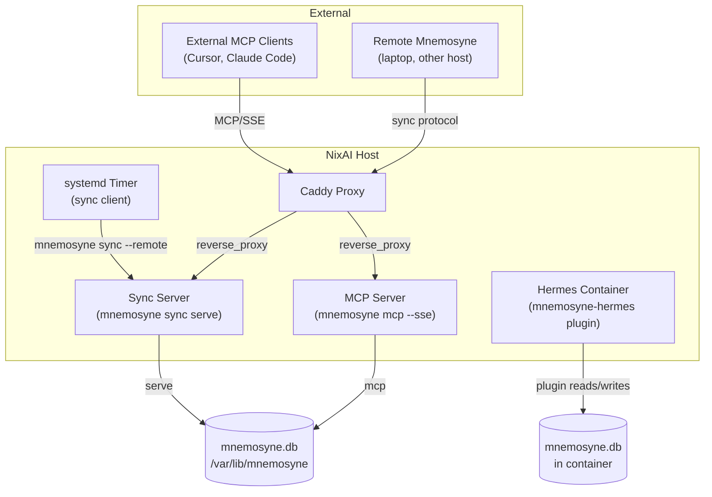

# Mnemosyne

SQLite-backed memory provider with sync and optional MCP server. Part of the `ai/` module tree.

## Architecture



## Options

{{#include ../../../../generated/ai-services-mnemosyne-options.md}}

## Usage Examples

### Server-only (central sync)

```nix
{
  services.mnemosyne = {
    enable = true;
    server.sync.enable = true;
  };
}
```

### Client-only (sync to remote)

```nix
{
  services.mnemosyne = {
    enable = true;
    client.sync.hermes = {
      enable = true;
      remote = "http://sync.example.com:8765";
      interval = "*:0/15";
    };
  };
}
```

## Notes

- Sync server uses `mnemosyne sync serve` with stdlib HTTP — no extra Python dependencies.
- MCP server adds `mcp` and `anyio` dependencies (via `pkgs.mnemosyne-mcp`).
- Sync protocol is plain HTTP with delta-based bidirectional sync.
- Sync interval default is 10 minutes.
