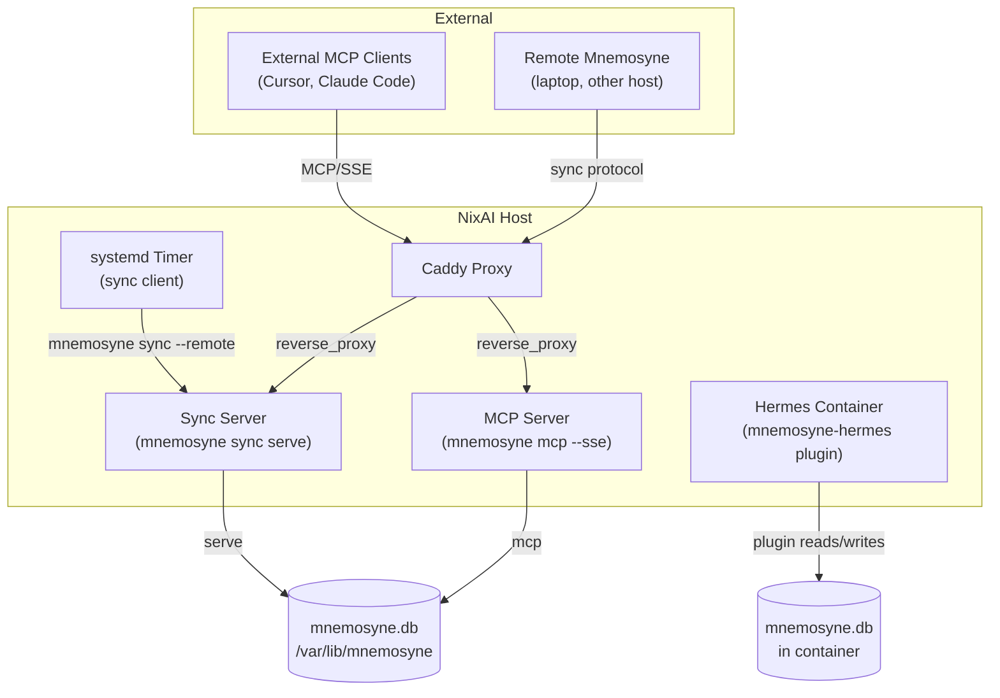

# Mnemosyne

SQLite-backed memory provider with sync and optional MCP server. Part of the `ai/` module tree.

## Architecture



## Options

{{#include ../../../../generated/ai-services-mnemosyne-options.md}}

## Usage Examples

### Server-only (central sync)

```nix
{
  ai.enable = true;
  services.mnemosyne = {
    enable = true;
    syncServer.enable = true;
  };
}
```

### Client-only (sync to remote)

```nix
{
  ai.enable = true;
  services.mnemosyne = {
    enable = true;
    syncClients.hermes = {
      remote = "http://sync.example.com:8765";
      interval = "15min";
    };
  };
}
```

### Full stack with Caddy

```nix
{
  ai.enable = true;
  services.mnemosyne = {
    enable = true;
    syncServer = {
      enable = true;
      host = "127.0.0.1";
      port = 8765;
    };
    mcpServer = {
      enable = true;
      host = "127.0.0.1";
      port = 8766;
    };
    syncClients.hermes = {
      remote = "http://127.0.0.1:8765";
      interval = "10min";
    };
    caddy = {
      enable = true;
      syncSubdomain = "sync";
      mcpSubdomain = "mnemosyne-mcp";
    };
  };
}
```

## Notes

- Sync server uses `mnemosyne sync serve` with stdlib HTTP — no extra Python dependencies.
- MCP server adds `mcp` and `anyio` dependencies (via `pkgs.mnemosyne-mcp`).
- Sync protocol is plain HTTP with delta-based bidirectional sync.
- Sync interval default is 10 minutes.
- `syncSubdomain` and `mcpSubdomain` are subdomain names only. The full domain is formed as `<subdomain>.<server.proxy.domain>` via the Caddy reverse proxy integration.
