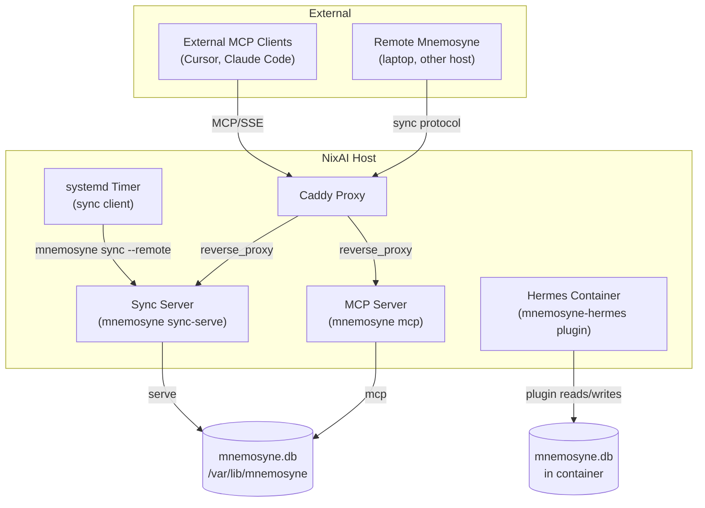

# Mnemosyne — SQLite-Backed Memory Provider

## Purpose

SQLite-backed memory provider with sync and optional MCP server. Part of the `ai/` module tree.

## Entry Point

- **Main file**: [mnemosyne.nix](../../../../../modules/nixos/ai/services/mnemosyne.nix)
- **Upstream**: [mnemosyne-oss/mnemosyne](https://pypi.org/project/mnemosyne-memory/)

## Architecture / Services / Scope


```mermaid
graph TB
    subgraph "NixAI Host"
        HC["Hermes Container<br/>(mnemosyne-hermes plugin)"]
        SS["Sync Server<br/>(mnemosyne sync-serve)"]
        MS["MCP Server<br/>(mnemosyne mcp)"]
        CD["Caddy Proxy"]
        CT["systemd Timer<br/>(sync client)"]
    end

    subgraph "External"
        EXT["External MCP Clients<br/>(Cursor, Claude Code)"]
        REMOTE["Remote Mnemosyne<br/>(laptop, other host)"]
    end

    HC -->|"plugin reads/writes"| DB[(mnemosyne.db<br/>in container)]
    CT -->|"mnemosyne sync --remote"| SS
    SS -->|"serve"| SDB[(mnemosyne.db<br/>/var/lib/mnemosyne)]
    MS -->|"mcp"| SDB
    CD -->|"reverse_proxy"| SS
    CD -->|"reverse_proxy"| MS
    EXT -->|"MCP/SSE"| CD
    REMOTE -->|"sync protocol"| CD
```

The module can run three kinds of services, each either natively on the host or inside a Docker container:

- **Sync server** (`mnemosyne sync-serve`) — stdlib HTTP, no extra Python dependencies.
- **MCP server** (`mnemosyne mcp`) — adds the `mcp` and `anyio` dependencies via the package's optional `mcp` group.
- **Sync client** — per-profile periodic sync to a remote server, driven by a systemd timer (default interval 10 minutes).

#### Options

{{#include ../../../../generated/ai-services-mnemosyne-options.md}}

## Secrets

- `MNEMOSYNE_SYNC_KEY` — API key for sync server authentication (host-level sops secret), provided via `apiKeyFile` and loaded into the services through systemd credentials.

## Operational Notes / Assumptions

- Sync protocol is plain HTTP with delta-based bidirectional sync.
- Sync interval default is 10 minutes.

### Usage Examples

#### Server-only (central sync)

```nix
{
  services.mnemosyne = {
    enable = true;
    server.sync.enable = true;
  };
}
```

#### Client-only (sync to remote)

```nix
{
  services.mnemosyne = {
    enable = true;
    client.sync.hermes = {
      enable = true;
      remote = "http://sync.example.com:8765";
      interval = "*:0/15";
    };
  };
}
```

## References

- [AI Modules](overview.md)
- [AI Agent (Mnemosyne memory)](../services/ai_agent.md)
