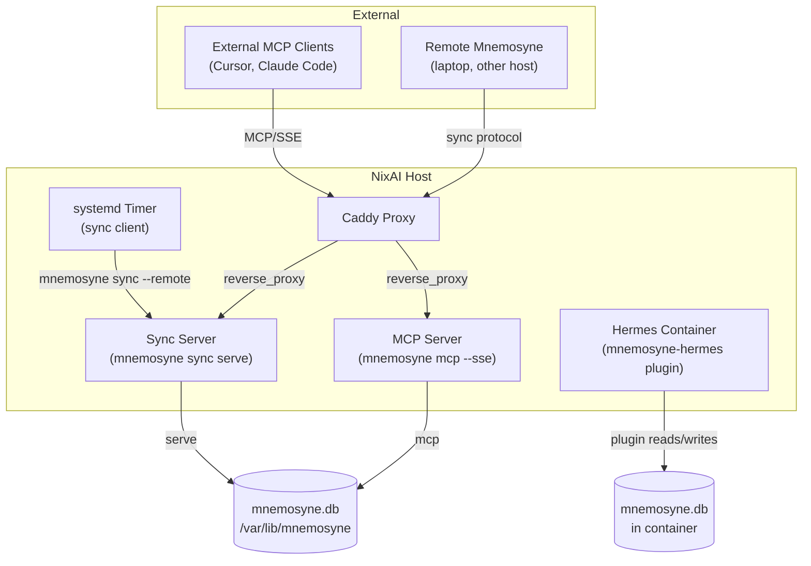

## Context

Hermes Agent on nixai currently uses Mnemosyne as an in-process memory provider (`mnemosyne-hermes` plugin loaded via `extraPythonPackages`). The SQLite DB lives inside the Docker container. Mnemosyne also supports two server modes that are not yet exposed:

- **Sync server** (`mnemosyne sync serve`): bidirectional delta sync over stdlib HTTP. Allows a central server to converge memory across multiple Hermes instances or backup clients.
- **MCP server** (`mnemosyne mcp --transport sse`): Model Context Protocol server for external MCP clients (Cursor, Claude Code, Codex) to query memory directly.

Currently there is no NixOS module for these modes, no sync orchestration, and no structured home for AI infrastructure beyond the monolithic `services.ai-agent` module.

### Architecture Overview

## Goals / Non-Goals

**Goals:**

- Provide a first-class NixOS module (`services.mnemosyne`) for running Mnemosyne in server modes
- Enable central sync server on nixai with cron-driven sync clients in Hermes
- Expose optional MCP server for external tool integration
- Integrate with existing Caddy proxy infrastructure
- Package `mnemosyne-memory[mcp]` variant as `pkgs.mnemosyne-mcp`
- Establish `modules/nixos/ai/` tree for future AI services

**Non-Goals:**

- Do NOT modify existing `services.ai-agent` or `services.hermes-agent` modules
- Do NOT add encryption to sync (XChaCha20-Poly1305) — future change
- Do NOT migrate ollama, open-webui, mcpo into new tree
- Do NOT implement multi-host sync mesh — single central server initially

## Decisions

### Decision 1: `services.mnemosyne` module with three sub-components

**Choice:** Single module with `syncServer`, `mcpServer`, `syncClients` attribute sets under `services.mnemosyne`.

**Alternatives considered:**
- Separate modules (`services.mnemosyne-sync`, `services.mnemosyne-mcp`) → Rejected: excessive boilerplate, all share same base package and data dir concerns
- Monolithic toggle flags → Rejected: harder to compose sync clients independently of servers

**Rationale:** Grouping under one namespace keeps related config together while sub-attributes allow independent enable/disable.

### Decision 2: Sync server uses base `mnemosyne-memory` (no extras)

**Choice:** Sync server (`mnemosyne sync serve`) is pure stdlib HTTP — zero Python deps beyond `mnemosyne-memory`. No `mcp` or `anyio` needed.

**Alternatives considered:**
- Use `mnemosyne-memory[all]` package → Rejected: pulls unnecessary deps for sync-only use
- Install both variants and pick → Rejected: complexity without benefit

**Rationale:** Minimal closure size. MCP variant (`pkgs.mnemosyne-mcp`) is a separate package only pulled in when `mcpServer.enable = true`.

### Decision 3: systemd timer for sync client, not Hermes cron

**Choice:** systemd `.timer` unit that runs `mnemosyne sync --remote <url>` inside the Hermes container via `docker exec`.

**Alternatives considered:**
- Hermes cron (YAML config) → Rejected: Hermes cron runs inside agent lifecycle, sync should be independent; harder to manage scheduling
- systemd service on host → Rejected: needs to access container's Python venv and DB path

**Rationale:** systemd timer provides reliable scheduling, logging via journald, and clean lifecycle management. `docker exec` reaches the container's environment.

### Decision 4: Caddy integration reuses `server.proxy` module, gated behind option existence

**Choice:** Module conditionally emits `server.proxy.virtualHosts` attributes only when `config.server ? proxy`. Since `modules/nixos/ai/` is separate from `modules/nixos/server/`, the `server.proxy` options may not exist on hosts that don't import the server module tree.

**Rationale:** Follows established proxy pattern but respects module independence. No hard dependency on server module. Hosts without Caddy skip proxy config silently.

**Implementation:** `lib.mkIf (config.server ? proxy) { ... }` guard around all `server.proxy.virtualHosts` emissions.

### Decision 5: Sync interval: 10 minutes default

**Choice:** Default sync client interval of 10 minutes (`*:0/10` systemd timer calendar event).

**Rationale:** Personal agent use case — changes are infrequent enough that 10-minute staleness is acceptable. Configurable per `syncClients.<name>.interval`.

## Risks / Trade-offs

- **SQLITE_BUSY with shared DB** → Sync server and MCP server should use separate DB paths by default. WAL mode enabled on all DBs. If user points both at same file, document the risk.
- **Container filesystem ephemerality** → Hermes container's `mnemosyne.db` needs a bind mount or volume to persist. Already handled by Hermes container config.
- **MCP server dependency not packaged in nixpkgs** → Need to verify `mcp` and `anyio` Python packages are available via `nixpkgs.python3Packages`. If not, add as custom packages.
- **Network partition during sync** → Sync protocol is delta-based with version chains — missed syncs accumulate deltas, next successful sync catches up. No data loss.
- **Caddy TLS for sync endpoint** → Relies on existing Caddy automatic HTTPS. Sync protocol is plain HTTP (no encryption layer) — acceptable for LAN/internal use. External sync should be behind Caddy TLS termination.
- **Cross-module option dependency** → `server.proxy` lives in `modules/nixos/server/`, separate from `modules/nixos/ai/`. Module must guard with `lib.mkIf (config.server ? proxy)` so hosts without server imports don't fail evaluation.

## Open Questions

- DNS records for `sync.racci.dev` and `mnemosyne-mcp.racci.dev`: exist already or need creation?
- Should sync server use authentication? (Sync protocol has no built-in auth; rely on Caddy layer if needed)
- Should we auto-cleanup old sync deltas? (Mnemosyne default retention: 30 days of event log)
