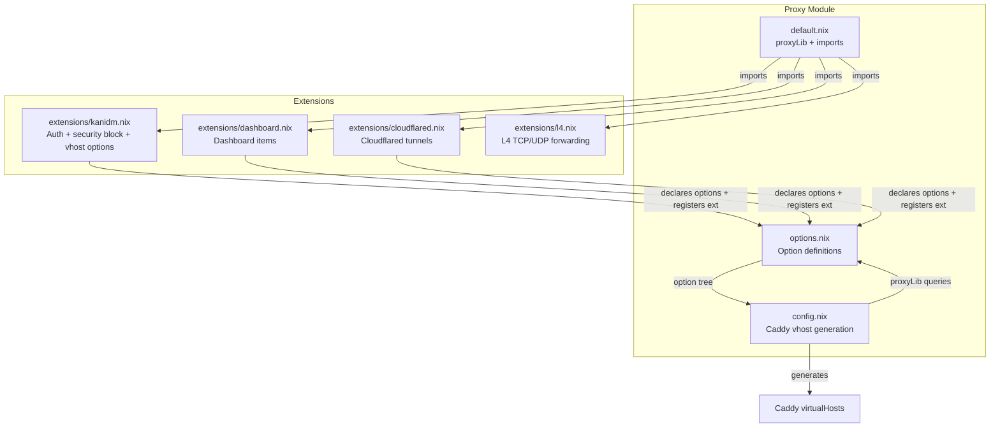
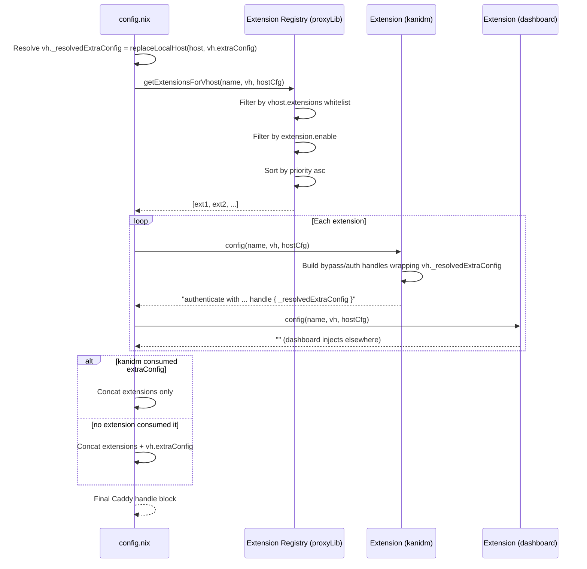

## Context

The proxy module (`modules/nixos/server/proxy/`) currently has five files:

| File | Role |
|------|------|
| `default.nix` | Helpers (`proxyLib`), imports sub-modules |
| `options.nix` | `server.proxy` option tree (domain, vhosts, kanidmContexts) |
| `config.nix` | Caddy vhost generation, ACME, L4 config — hardcodes Kanidm auth inside `extraConfig` |
| `kanidm.nix` | Global `security` block (identity providers, portals, policies) |
| `extensions.nix` | Dashboard items, Cloudflared tunnels, Kanidm provisioning (sops + oauth2 systems) |

The key problem: `config.nix` directly checks `vh.kanidm != null` and generates auth directives inline. Any new cross-cutting vhost concern (rate limiting, crowdsec, WAF) would require editing `config.nix` — violating open/closed principle.

The registry pattern replaces inline conditionals with a sorted list of `extension -> config string` functions. Extensions self-register; the proxy core just iterates and concatenates.

**Structural challenge — current bypass path design**: The current kanidm auth block wraps `vh.extraConfig` inside `handle` blocks for bypass and auth:

```
@bypass_auth_NAME path /health
handle @bypass_auth_NAME {
  ${vh.extraConfig}      ← extraConfig inside bypass handle
}
route /auth/* { authenticate with NAME_portal }
handle {
  authorize with NAME_policy
  ${vh.extraConfig}      ← extraConfig inside auth handle
}
```

The extension's `config` function must receive `vh.extraConfig` (with `replaceLocalHost` already applied) as part of the vhost attrset, so it can embed it inside its generated handle blocks. The orchestrator in `config.nix` detects when an extension has already consumed `extraConfig` and skips the post-append.

## Goals / Non-Goals

**Goals:**
- Add `server.proxy.extensions` as a named registry of extension modules with priority ordering
- Add `server.proxy.virtualHosts.<name>.extensions` as a per-vhost allowlist
- Render each extension's config into the vhost Caddy block, sorted by priority
- Migrate Kanidm auth from `config.nix` into a self-registered extension
- Migrate `public` option and `import public` from `options.nix` + `config.nix` into Cloudflared extension
- Migrate dashboard and Cloudflared wiring from `extensions.nix` into separate extensions
- Retire `kanidm.nix` — its global security block moves into the kanidm extension's `globalConfig`
- Keep existing vhost option shapes unchanged (no downstream host config edits)
- Migrate L4 (layer4 Caddy config + firewall ports) from config.nix into a self-registered extension

**Non-Goals:**
- Add new extensions beyond the three migrated ones (framework only)
- Allow extensions to modify proxy options — they only read vhost/host attrs and return strings
- Support extension dependencies or ordering constraints beyond numeric priority

## Decisions

### Decision 1: Extension submodule shape

Each extension entry in `server.proxy.extensions` is a submodule with:

```nix
{
  priority = mkOption {
    type = int;
    default = 100;
    description = "Lower values = earlier in Caddy config. Priority ranges: 0-49 reserved, 50-99 auth, 100-199 general, 200+ post-processing.";
  };
  config = mkOption {
    type = types.functionTo types.str;
    description = "Function: vhostName -> vhostAttrSet -> hostConfig -> string. Returns Caddy directives to inject, or '' for no-op.";
  };
  enable = mkOption {
    type = bool;
    default = false;
    description = "Auto-managed by each extension via mkDefault based on whether relevant config exists.";
  };
  consumesExtraConfig = mkOption {
    type = bool;
    default = false;
    description = "Whether this extension embeds extraConfig inside its output.";
  };
  globalConfig = mkOption {
    type = types.functionTo types.str;
    default = _: "";
    description = "Function: hostConfig -> string. Caddy directives for the top-level globalConfig block.";
  };
}
```

**Rationale**: `config` receives `vhostName` (needed for kanidm portal/policy references), the vhost attrset (including `_resolvedExtraConfig`), and host config. `consumesExtraConfig` signals to `config.nix` that the extension already embedded `extraConfig`, preventing double-emission.

`globalConfig` is called once per extension on the IO primary host. Enabled extensions with non-empty output are sorted by priority and concatenated into `services.caddy.globalConfig`. The existing `kanidm.nix` file is retired — its `security` block moves into the kanidm extension's `globalConfig`.

**Auto-enable pattern**: `enable` defaults to `false`. Each extension sets it to `true` via `mkDefault` when it detects relevant configuration:
- Kanidm: `enable = mkDefault proxyLib.hasAnyKanidm`
- Dashboard: `enable = mkDefault (cfg.virtualHosts != {})`
- Cloudflared: `enable = mkDefault (any vhost has public == true)`

User can force-disable with an explicit `enable = false` (beats `mkDefault`).

### Decision 2: Add `name` read-only option to vhost submodule

```nix
_name = mkOption {
  type = str;
  default = name;
  readOnly = true;
  internal = true;
};
```

Extensions need `vh._name` to generate name-scoped identifiers (e.g., `authenticate with ${name}_portal`).

### Decision 3: Extension config insertion point and extraConfig handling

Extension outputs go **before** user `extraConfig`. If any extension with `consumesExtraConfig = true` returned non-empty output, `config.nix` skips appending `extraConfig`.

```
extension_1 config (may embed extraConfig inside)
extension_2 config
user extraConfig (skipped if consumed)
```

**Rationale**: Kanidm's bypass/auth handles must wrap `extraConfig` inside them. Other extensions that don't need to wrap extraConfig just return their directives, and config.nix appends extraConfig afterwards as usual.

### Decision 4: Migration strategy for Kanidm

The kanidm extension registers via `importModule`:

```nix
(importModule ./extensions/kanidm.nix { inherit proxyLib; })
```

Sets `server.proxy.extensions.kanidm` with: `priority = 50`, `consumesExtraConfig = true`, per-vhost config function for auth directives, globalConfig function for the `security` block.

The existing `kanidm.nix` file is deleted. `config.nix` loses the inline kanidm auth block.

### Decision 5: Registry access mechanism

`config.nix` accesses extensions through `proxyLib`:

```nix
getExtensionsForVhost = vhostName: vhostAttr: hostCfg:
  let
    exts = config.server.proxy.extensions or {};
    enabled = builtins.filter (ext: ext.enable) (builtins.attrValues exts);
    whitelisted = if vhostAttr.extensions == null then enabled
                  else builtins.filter (ext: builtins.elem ext._name vhostAttr.extensions) enabled;
    sorted = builtins.sort (a: b: if a.priority == b.priority
                                  then a._name < b._name
                                  else a.priority < b.priority) whitelisted;
  in sorted;

getGlobalConfigFromExtensions = hostCfg:
  let
    exts = config.server.proxy.extensions or {};
    enabled = builtins.filter (ext: ext.enable) (builtins.attrValues exts);
    sorted = builtins.sort (a: b: if a.priority == b.priority
                                  then a._name < b._name
                                  else a.priority < b.priority) enabled;
    outputs = map (ext: ext.globalConfig hostCfg) sorted;
  in builtins.concatStringsSep "\n" (builtins.filter (s: s != "") outputs);
```

### Decision 6: Per-vhost extension whitelist

```nix
virtualHosts.<name>.extensions = mkOption {
  type = nullOr (listOf str);
  default = null;  # null = all extensions
};
```

Assertions: whitelist names must exist in registry; `extensions = []` + `kanidm != null` warns.

### Decision 7: Dashboard and Cloudflared as extensions

**Dashboard** (`extensions/dashboard.nix`): Config function returns `""`. Actual work in module config setting `server.dashboard.items`.

**Cloudflared** (`extensions/cloudflared.nix`): Fully owns the `public` concept:
- Declares `options.server.proxy.virtualHosts.<name>.public` via native module `options` (moved from `options.nix`)
- Returns `import public` from config function when `vh.public == true` (moved from `config.nix`)
- Sets `services.cloudflared.tunnels` ingress from module config for vhosts with `public == true` (moved from `extensions.nix`)
- Auto-enables via `mkDefault` when any vhost has `public == true`

### Decision 8: Single consumer of extraConfig

At most one extension with `consumesExtraConfig = true` per vhost. Assertion enforced.

### Decision 9: Extension options via native NixOS module merging

No special injection mechanism needed. Extension files are imported by `default.nix` at the same scope as `options.nix`. Extensions declare options directly in their own `options` block using the full path. NixOS merges all `options` declarations across all imported modules.

**Vhost-level options** (e.g., `kanidm` on each virtual host):

```nix
# In extensions/kanidm.nix:
{
  options.server.proxy.virtualHosts.<name>.kanidm = {
    scopes = mkOption { ... };
    allowGroups = mkOption { ... };
    bypassPaths = mkOption { ... };
  };
}
```

**Top-level proxy options** (e.g., `kanidmContexts`):

```nix
# In extensions/kanidm.nix:
{
  options.server.proxy.kanidmContexts = mkOption { ... };
}
```

### Decision 10: `extensions.nix` retains Kanidm provisioning

After migration, `extensions.nix` keeps only Kanidm provisioning (sops secrets, oauth2 systems). The file is renamed to `kanidm-provisioning.nix` for clarity.

### Decision 11: L4 extension — pure extraction, priority 10

The L4 config generation in `config.nix` (lines 45-90) and L4 vhost options in `options.nix` (lines 168-184) migrate to a new extension `extensions/l4.nix`. No behavioral changes — the generated Caddy config is byte-identical before and after migration.

**Extension shape:**
```nix
server.proxy.extensions.l4 = {
  priority = 10;           # System-level, runs before all HTTP extensions
  consumesExtraConfig = false;  # L4 doesn't touch HTTP extraConfig
  enable = mkDefault (any vhost has l4 != null);  # Auto-enable pattern
  config = name: vh: hostCfg: "";  # No per-vhost HTTP config injection
  globalConfig = hostCfg: /* layer4 { ... } block */;
  vhostModule = { options.l4 = mkOption { type = nullOr (submodule { ... }); }; };
};
```

**How L4 differs from HTTP extensions:**
- L4 `config` function returns `""` — L4 has no per-vhost HTTP Caddy directives
- L4 `globalConfig` generates the entire `layer4 {}` block (not just directives to concatenate) — this is the primary output
- L4 also manages `networking.firewall` ports via its module `config` block (not via extension functions) — same pattern dashboard uses for `server.dashboard.items`

**Migration steps:**
1. Create `extensions/l4.nix` with the extension registration, vhost option declaration, globalConfig function (collecting L4 entries via `collectAllAttrsFunc`, grouping by port), and firewall `config` block
2. Import it in `proxy/default.nix`: `(importModule ./extensions/l4.nix { inherit proxyLib; })`
3. Remove `l4` option from `options.nix` vhost submodule
4. Remove `l4Config` let-binding, `layer4 {}` block wrapping, and firewall L4 port handling from `config.nix`
5. Verify existing hosts (nixai, nixcloud) produce identical Caddy `layer4 {}` blocks

**Dependencies:** The extension module receives `isThisIOPrimaryHost`, `collectAllAttrsFunc`, `getAllAttrsFunc`, and `replaceLocalHost` as top-level parameters (same as cloudflared extension). The `globalConfig` function closes over `collectAllAttrsFunc` and `replaceLocalHost` to traverse hosts and resolve addresses.

**Risk:** `getAllAttrsFunc` and `collectAllAttrsFunc` traverse all host configs — this is the same pattern used by existing extensions (kanidm's `hasAnyKanidm`, cloudflared's `getAllAttrsFunc` for public hosts). No new risk.

## Component Diagram



## Sequence: Vhost Config Generation



## Risks / Trade-offs

- **Risk**: Extension `config` function has access to full host config. → **Mitigation**: In-tree code only, not a plugin system.
- **Risk**: Priority conflicts. → **Mitigation**: Documented priority ranges (0-49 reserved, 50-99 auth, 100-199 general, 200+ post).
- **Trade-off**: Kanidm auth flow split across files. → **Accepted**: Registry pattern is the standard.
- **Risk**: `functionTo` merge is silent composition. → **Mitigation**: Reserved range assertion.
- **Risk**: Dashboard config function called for every vhost but returns `""`. → **Accepted**: Negligible cost.
