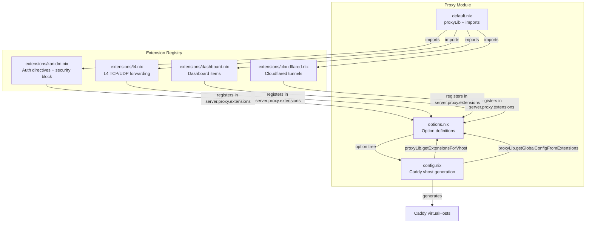
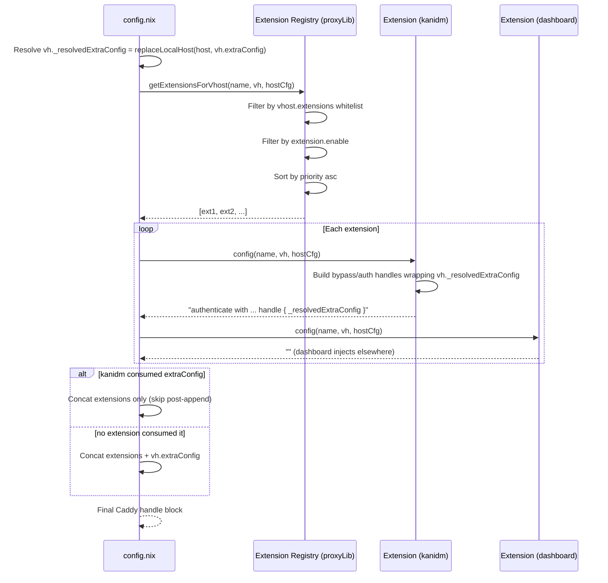

## Context

The proxy module (`modules/nixos/server/proxy/`) currently has five files:

| File | Role |
|------|------|
| `default.nix` | Helpers (`proxyLib`), imports sub-modules |
| `options.nix` | `server.proxy` option tree (domain, vhosts, kanidmContexts) |
| `config.nix` | Caddy vhost generation, ACME — hardcodes Kanidm auth inside `extraConfig` |
| `kanidm.nix` | Global `security` block (identity providers, portals, policies) |
| `extensions.nix` | Dashboard items, Cloudflared tunnels, Kanidm provisioning (sops + oauth2 systems) |

**Post-L4-extension**: L4 config (layer4 globalConfig block, firewall ports) moves to extensions/l4.nix. config.nix no longer contains L4 logic.

The key problem: `config.nix` directly checks `vh.kanidm != null` and generates auth directives inline. Any new cross-cutting vhost concern (rate limiting, crowdsec, WAF) would require editing `config.nix` — violating open/closed principle.

The registry pattern replaces inline conditionals with a sorted list of `extension -> config string` functions. Extensions self-register; the proxy core just iterates and concatenates.

**Structural challenge — current bypass path design**: The current kanidm auth block wraps `vh.extraConfig` inside `handle` blocks for bypass and auth:

```
@bypass_auth_NAME path /health
handle @bypass_auth_NAME {
  ${vh.extraConfig}      ← extraConfig inside bypass handle
}
route /auth/* { authenticate with NAME_portal }
handle {
  authorize with NAME_policy
  ${vh.extraConfig}      ← extraConfig inside auth handle
}
```

The extension's `config` function must receive `vh.extraConfig` (with `replaceLocalHost` already applied) as part of the vhost attrset, so it can embed it inside its generated handle blocks. The orchestrator in `config.nix` detects when an extension has already consumed `extraConfig` and skips the post-append.

## Goals / Non-Goals

**Goals:**
- Add `server.proxy.extensions` as a named registry of extension modules with priority ordering
- Add `server.proxy.virtualHosts.<name>.extensions` as a per-vhost allowlist
- Render each extension's config into the vhost Caddy block, sorted by priority
- Migrate Kanidm auth from `config.nix` into a self-registered extension
- Migrate dashboard and Cloudflared wiring from `extensions.nix` into separate extensions
- Retire `kanidm.nix` — its global security block moves into the kanidm extension's `globalConfig`
- Keep existing vhost option shapes unchanged (no downstream host config edits)
- Migrate L4 (layer4 Caddy config + firewall ports) from config.nix into a self-registered extension

**Non-Goals:**
- Add new extensions beyond the three migrated ones (framework only)
- Allow extensions to modify proxy options — they only read vhost/host attrs and return strings
- Support extension dependencies or ordering constraints beyond numeric priority

**Non-Goals:**
- Change L4 behavior or routing logic — pure extraction, no functional changes

## Decisions

### Decision 1: Extension submodule shape

Each extension entry in `server.proxy.extensions` is a submodule with:

```nix
{
  priority = mkOption {
    type = int;
    default = 100;
    description = "Lower values = earlier in Caddy config. Priority ranges: 0-49 reserved, 50-99 auth, 100-199 general, 200+ post-processing.";
  };
  config = mkOption {
    type = types.functionTo types.str;
    description = "Function: vhostName -> vhostAttrSet -> hostConfig -> string. Returns Caddy directives to inject, or '' for no-op. The vhostAttrSet includes the resolved extraConfig (already localhost-replaced) as `_resolvedExtraConfig`.";
  };
  enable = mkOption {
    type = bool;
    default = false;
    description = ''
      Whether this extension is globally enabled.
      Each extension SHOULD auto-detect whether it has work to do and set this to `true` via `mkDefault` in its module config.
      User can explicitly override to force-disable (higher merge priority than mkDefault).
    '';
  };
  consumesExtraConfig = mkOption {
    type = bool;
    default = false;
    description = "Whether this extension embeds extraConfig inside its output. When true, config.nix skips the post-extension extraConfig append for this vhost.";
  };
  globalConfig = mkOption {
    type = types.functionTo types.str;
    default = _: "";
    description = "Function: hostConfig -> string. Returns Caddy directives to inject into the top-level globalConfig block. Only called on the IO primary host. Sorted by priority across extensions.";
  };
  vhostModule = mkOption {
    type = nullOr types.deferredModule;
    default = null;
    description = "Optional module to inject into each vhost submodule. Use `options.<extensionName>` (relative to vhost scope) to declare per-vhost options.";
  };
}
```

**Rationale**: `config` receives `vhostName` (needed for kanidm portal/policy references like `${name}_portal`), the vhost attrset (including `_resolvedExtraConfig` — the user's `extraConfig` with `replaceLocalHost` applied), and host config. `consumesExtraConfig` signals to `config.nix` that the extension already included `extraConfig`, preventing double-emission.

`globalConfig` is called once per extension (not per-vhost) on the IO primary host. It receives only `hostConfig` — no vhost context. Enabled extensions with non-empty `globalConfig` output are sorted by priority and concatenated into `services.caddy.globalConfig`. The existing `kanidm.nix` file (which generates the `security` block) will be retired — its logic moves into the kanidm extension's `globalConfig` function.

`vhostModule` replaces the rejected `vhostExtensionModules` approach. Each extension optionally provides a module to inject into the vhost submodule's `imports`. Since it's imported inside the submodule, its `options` path is relative — `options.<extensionName>` maps to `server.proxy.virtualHosts.<name>.<extensionName>`. No separate top-level option needed.

**Auto-enable pattern**: `enable` defaults to `false`. Each extension sets it to `true` via `mkDefault` in its module config when it detects relevant configuration:
- Kanidm: `enable = mkDefault proxyLib.hasAnyKanidm` (true when any vhost has `kanidm != null`)
- Dashboard: `enable = mkDefault (cfg.virtualHosts != {})` (true when any vhosts exist)
- Cloudflared: `enable = mkDefault (any vhost has public == true)`

Since `mkDefault` has lower merge priority than explicit user values, the user can set `server.proxy.extensions.kanidm.enable = false` to force-disable. An extension with `enable = false` is skipped entirely — its `config` function is never called and its vhost options are irrelevant.

**Alternative considered**: Extensions return the full handle structure with a `EXTRA_CONFIG_HERE` placeholder for string substitution. Rejected — fragile and harder to debug.

### Decision 2: Add `name` read-only option to vhost submodule

The vhost submodule currently receives `{ name, ... }` as a module argument but `name` is not stored as an option. Extensions need it (kanidm generates `authenticate with ${name}_portal`). Add a read-only option:

```nix
_name = mkOption {
  type = str;
  default = name;
  readOnly = true;
  internal = true;
  description = "The attribute name of this virtual host in the virtualHosts attrset.";
};
```

### Decision 3: Extension config insertion point and extraConfig handling

Extension-generated strings go **before** the user's remaining `extraConfig`. However, if any extension has `consumesExtraConfig = true` and returns non-empty output, `config.nix` skips appending `extraConfig` (the extension already embedded it).

```
extension_1 config (may include extraConfig inside)
extension_2 config
user extraConfig (skipped if consumed by extension)
```

**Rationale**: Kanidm's bypass/auth handles must wrap `extraConfig` inside them. Other extensions that don't need to wrap extraConfig just return their directives, and config.nix appends extraConfig afterwards as usual.

### Decision 4: Migration strategy for Kanidm

The kanidm extension registers itself in `default.nix`'s imports via `importModule`:

```nix
(importModule ./extensions/kanidm.nix { inherit proxyLib; })
```

This file:
1. Sets `server.proxy.extensions.kanidm` with `priority = 50`, `consumesExtraConfig = true`, config function for per-vhost auth directives, globalConfig function for the `security` block, and vhostModule for per-vhost `kanidm` options
2. Reuses `resolveKanidmContext` from `proxyLib` for vhost-kanidm-context resolution
3. Returns `""` if `vh.kanidm == null` (no-op for non-auth vhosts)
4. When `vh.kanidm != null`, returns the full bypass/auth handle structure with `_resolvedExtraConfig` embedded

The existing `kanidm.nix` file is deleted — all its logic (security block, order directives) moves into the extension. `config.nix` loses the inline kanidm auth block.

### Decision 5: Registry access mechanism

`config.nix` accesses extensions through `proxyLib` functions:

```nix
# In proxyLib (default.nix):
getExtensionsForVhost = vhostName: vhostAttr: hostCfg:
  let
    exts = config.server.proxy.extensions or {};
    enabled = builtins.filter (ext: ext.enable) (builtins.attrValues exts);
    whitelisted = if vhostAttr.extensions == null then enabled
                  else builtins.filter (ext: builtins.elem ext._name vhostAttr.extensions) enabled;
    sorted = builtins.sort (a: b: if a.priority == b.priority
                                  then a._name < b._name
                                  else a.priority < b.priority) whitelisted;
  in sorted;
```

This function is passed the vhost name, vhost attrset, and host config, and returns a sorted list of enabled extension submodules. `config.nix` iterates this list, calling each `config` function in order.

**Note**: This function exists in `proxyLib` (defined in `default.nix`'s `let` block) but `proxyLib` is constructed before `config` is available. The function must be lazy — it captures `config` from the outer scope where `default.nix` receives `{ config, ... }`. Verified: the `default.nix` module function *does* receive `config` via `{ config, lib, ... }` → `{ ... }` pattern. The closure captures it at evaluation time when the function is first called, which is during config evaluation — correct.

### Decision 6: Per-vhost extension whitelist

`virtualHosts.<name>.extensions` defaults to `null`, which means "all registered extensions". Setting it to a list (e.g., `[ "kanidm" ]`) restricts that vhost to only those extensions.

```nix
virtualHosts.<name>.extensions = mkOption {
  type = nullOr (listOf str);
  default = null;  # null = all extensions
};
```

**Rationale**: Most vhosts want all extensions. The whitelist is for vhosts that need to opt out. An assertion validates that whitelist names exist in the registry, and that `extensions = []` + `kanidm != null` raises a warning.

### Decision 7: Dashboard and Cloudflared as extensions

Dashboard: `extensions/dashboard.nix` sets `server.proxy.extensions.dashboard = { priority = 200; config = ... }` — the config function returns `""` (it's a vhost-iterated no-op). The dashboard actually operates on `server.dashboard.items` in its module config (not the config function).

Cloudflared: `extensions/cloudflared.nix` similarly operates on `services.cloudflared.tunnels` from its module config, returns `""` from its config function.

These are extensions in the registry sense (enabled/disabled, prioritized) even though their `config` function returns empty string. Their module config sets system-level options (`server.dashboard.items`, `services.cloudflared`) that don't go into the vhost Caddy block. Priority is irrelevant for them but included for consistency.

### Decision 8: Single consumer of extraConfig

At most one extension with `consumesExtraConfig = true` may be enabled for any given vhost. An assertion enforces this at evaluation time. This prevents undefined behavior where two extensions both try to wrap `extraConfig` inside their output (only one can consume it).

### Decision 9: Extension options — vhost-level and top-level `server.proxy`

Extensions MUST be able to declare their own NixOS options in two locations:

**A. Vhost-level options** (inside `server.proxy.virtualHosts.<name>`): Each extension has a `vhostModule` field (`nullOr types.deferredModule`, default `null`). The vhost submodule in `options.nix` collects non-null `vhostModule` values from all enabled extensions and includes them in its `imports`:

```nix
# In options.nix — the vhost submodule imports extension vhostModules:
virtualHosts = mkOption {
  type = attrsOf (submodule ({ name, ... }: {
    imports =
      config.server.proxy.extensions
      |> builtins.attrValues
      |> builtins.filter (ext: ext.enable && ext.vhostModule != null)
      |> map (ext: ext.vhostModule);
    options = { /* built-in options: aliases, ports, extraConfig, ... */ };
  }));
};
```

No separate `vhostExtensionModules` option — the vhost submodule reads directly from the extension registry.

Each extension sets `vhostModule` to a module declaring relative options:

```nix
# In extensions/kanidm.nix:
{
  config = {
    server.proxy.extensions.kanidm = {
      priority = 50;
      consumesExtraConfig = true;
      enable = mkDefault proxyLib.hasAnyKanidm;
      config = /* ... */;
      globalConfig = /* ... */;
      vhostModule = {
        options.kanidm = { /* relative to vhost submodule scope */ };
      };
    };
  };
}
```

Note: `vhostModule` declares `options.kanidm` (NOT `options.server.proxy.virtualHosts.<name>.kanidm`) because it's imported inside the vhost submodule's `imports` — its option path is relative.

**B. Top-level `server.proxy` options** (like `kanidmContexts`): Extensions declare these directly in their module's `options` block. The NixOS module system merges them into `server.proxy` automatically since extension modules are imported under `server.proxy`'s parent scope. Example: the kanidm extension declares `options.server.proxy.kanidmContexts` in its own module.

**Rationale**: The vhost submodule must know about extension-declared options at submodule-construction time (when `types.submodule` is called). Collecting `vhostModule` from the registry at eval time satisfies this. No separate `vhostExtensionModules` list needed — each extension owns its own vhost module inline.

### Decision 10: `extensions.nix` retains Kanidm provisioning

After migration, `extensions.nix` keeps only Kanidm provisioning (sops secrets, oauth2 systems). The file is renamed to `kanidm-provisioning.nix` for clarity.

### Decision 11: L4 extension — pure extraction, priority 10

The L4 config generation in `config.nix` (lines 45-90) and L4 vhost options in `options.nix` (lines 168-184) migrate to a new extension `extensions/l4.nix`. No behavioral changes — the generated Caddy config is byte-identical before and after migration.

**Extension shape:**
```nix
server.proxy.extensions.l4 = {
  priority = 10;           # System-level, runs before all HTTP extensions
  consumesExtraConfig = false;  # L4 doesn't touch HTTP extraConfig
  enable = mkDefault (any vhost has l4 != null);  # Auto-enable pattern
  config = name: vh: hostCfg: "";  # No per-vhost HTTP config injection
  globalConfig = hostCfg: /* layer4 { ... } block */;
  vhostModule = { options.l4 = mkOption { type = nullOr (submodule { ... }); }; };
};
```

**How L4 differs from HTTP extensions:**
- L4 `config` function returns `""` — L4 has no per-vhost HTTP Caddy directives
- L4 `globalConfig` generates the entire `layer4 {}` block (not just directives to concatenate) — this is the primary output
- L4 also manages `networking.firewall` ports via its module `config` block (not via extension functions) — same pattern dashboard uses for `server.dashboard.items`

**Migration steps:**
1. Create `extensions/l4.nix` with the extension registration, vhost option declaration, globalConfig function (collecting L4 entries via `collectAllAttrsFunc`, grouping by port), and firewall `config` block
2. Import it in `proxy/default.nix`: `(importModule ./extensions/l4.nix { inherit proxyLib; })`
3. Remove `l4` option from `options.nix` vhost submodule
4. Remove `l4Config` let-binding, `layer4 {}` block wrapping, and firewall L4 port handling from `config.nix`
5. Verify existing hosts (nixai, nixcloud) produce identical Caddy `layer4 {}` blocks

**Dependencies:** The extension module receives `isThisIOPrimaryHost`, `collectAllAttrsFunc`, `getAllAttrsFunc`, and `replaceLocalHost` as top-level parameters (same as cloudflared extension). The `globalConfig` function closes over `collectAllAttrsFunc` and `replaceLocalHost` to traverse hosts and resolve addresses.

**Risk:** `getAllAttrsFunc` and `collectAllAttrsFunc` traverse all host configs — this is the same pattern used by existing extensions (kanidm's `hasAnyKanidm`, cloudflared's `getAllAttrsFunc` for public hosts). No new risk.

## Component Diagram



## Sequence: Vhost Config Generation (with extraConfig wrapping)



## Risks / Trade-offs

- **Risk**: Extension `config` function has access to full host config — could read secrets, cause infinite recursion, etc. → **Mitigation**: Extensions are trusted code in-tree; not a plugin system for third parties.
- **Risk**: Priority conflicts between extensions that don't know about each other. → **Mitigation**: Document priority ranges (0-49 reserved, 50-99 auth, 100-199 general, 200+ post-processing).
- **Trade-off**: Migrating kanidm from `config.nix` to an extension means two files must be read to understand auth flow, not one. → **Accepted**: The registry pattern is the standard pattern; new extensions follow it, so kanidm should too.
- **Risk**: `extensions.nix` currently handles Kanidm provisioning (sops secrets, oauth2 systems). Moving dashboard/cloudflared out but leaving provisioning in creates fragmentation. → **Mitigation**: Rename `extensions.nix` to `kanidm-provisioning.nix`; only Kanidm provisioning remains in it.
- **Risk**: `functionTo` merge is silent function composition — if two modules set the same extension's `config`, the merged result is garbage (first function's string output is passed as vhost attrset to second). → **Mitigation**: In-tree extensions are set once; document that `functionTo` merging is undefined for this use case. An assertion detects duplicate extension registrations.
- **Risk**: Dashboard extension's `config` function is called for every vhost but always returns `""` — wasted computation. → **Accepted**: Pragmatic reuse of the registry for system-level extensions that happen to not generate per-vhost Caddy config. The cost is negligible.
- **Trade-off**: L4 extension has an empty per-vhost `config` function (always returns `""`) because L4 config goes into the `layer4 {}` global block, not individual HTTP vhost blocks. → **Accepted**: The extension still uses per-vhost options (`l4.listenPort`, `l4.config`) for configuration; the `config` function is the wrong injection point for L4. The `globalConfig` function is the correct mechanism.
