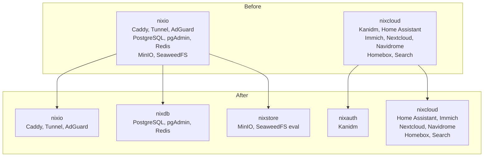
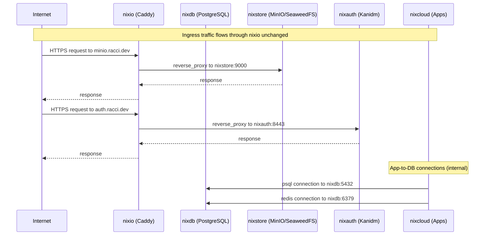
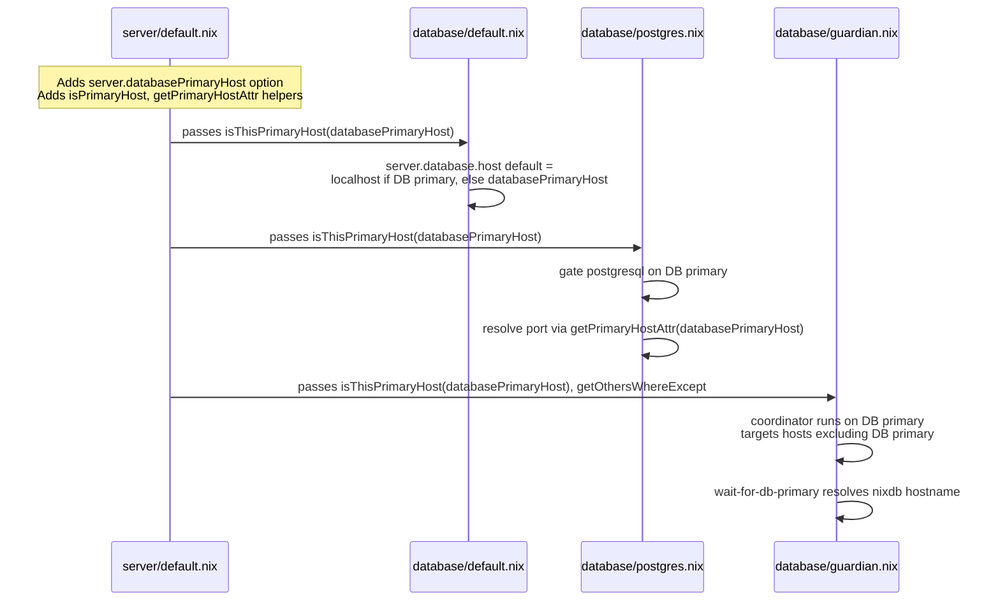
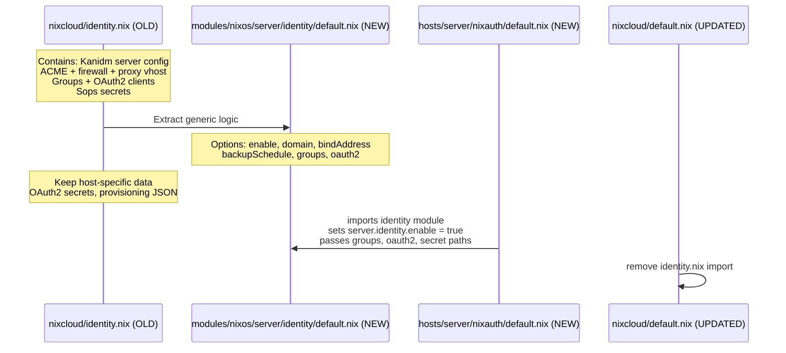
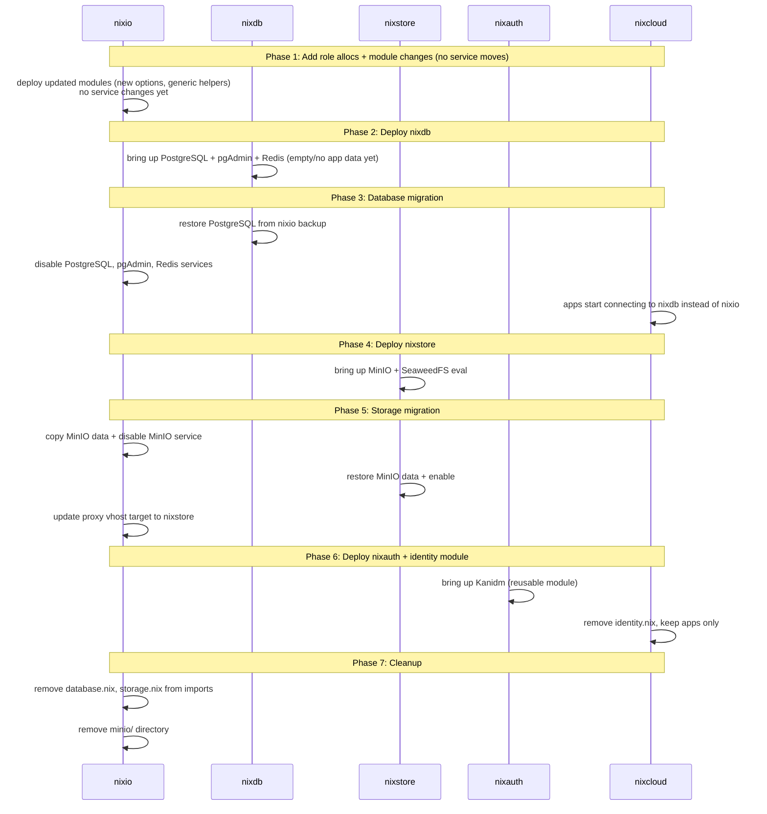

# Design: Reallocate Server Service Roles

## Context

The cluster currently runs five server hosts (`nixio`, `nixcloud`, `nixarr`, `nixmon`, `nixserv`). `nixio` is the ingress/network primary and also runs PostgreSQL, pgAdmin, Redis, MinIO, and SeaweedFS evaluation. `nixcloud` runs all application workloads (Home Assistant, Immich, Nextcloud, etc.) plus Kanidm identity.

This coupling forces coordinated downtime across unrelated service areas, conflates blast radius (storage failure takes down the proxy), and makes the config layer ambiguous — `server.ioPrimaryHost` is used to gate database, storage, proxy, and network modules interchangeably.

The proposal splits these roles onto three new dedicated hosts — `nixdb`, `nixstore`, `nixauth` — plus extracts Kanidm from `nixcloud` into a reusable module. This design details how.

## Goals / Non-Goals

### Goals

- **Decomposed cluster roles**: Each new host has a single service responsibility. Dependencies between roles are explicit via host references, not implicit because they share a machine.
- **Generalized primary-host resolution**: Database, storage, and identity modules use their own role selector (`server.databasePrimaryHost`, etc.) instead of piggybacking on `server.ioPrimaryHost`. Modules check the correct selector to decide whether to enable services locally.
- **Reusable identity module**: The Kanidm configuration in `hosts/server/nixcloud/identity.nix` is split into a reusable NixOS module at `modules/nixos/server/identity/` plus a thin host-level overlay on `nixauth`.
- **Backward-compatible proxy pattern**: Caddy and all proxy extensions remain on `nixio`. Services that move to new hosts (MinIO, Kanidm) are reached through Caddy on `nixio` via reverse proxy — the same pattern used today for application vhosts on `nixcloud`.
- **Zero-downtime migration sequencing**: Services are moved one role at a time, with the proxy role staying stable throughout.

### Non-Goals

- Re-architecting the proxy layer or Caddy config generation
- Migrating application workloads (they stay on `nixcloud`)
- Changing the storage backend (MinIO stays; SeaweedFS evaluation moves as-is)
- Refactoring monitoring or distributed builder allocations
- Adding new software or features — only reallocation and generalization

## Decisions

### Decision 1: Add three role selectors, following the existing pattern

Add `databasePrimaryHost`, `storagePrimaryHost`, `authPrimaryHost` to `allocations.server` in `modules/flake/allocations.nix`, using the same `serverHostnamesEnum` type as `ioPrimaryCoordinator` and `monitoringPrimaryHost`.

```nix
databasePrimaryHost = mkOption {
  type = serverHostnamesEnum;
  description = "Designate a server to run shared PostgreSQL, pgAdmin, and Redis.";
};

storagePrimaryHost = mkOption {
  type = serverHostnamesEnum;
  description = "Designate a server to run shared MinIO and SeaweedFS evaluation.";
};

authPrimaryHost = mkOption {
  type = serverHostnamesEnum;
  description = "Designate a server to run Kanidm identity services.";
};
```

In `modules/flake/apply/system.nix`, map these into `server.*` options alongside the existing `ioPrimaryHost`:

```nix
optionalAttrs (deviceType == "server") {
  server.ioPrimaryHost = allocations.server.ioPrimaryCoordinator;
  server.monitoringPrimaryHost = allocations.server.monitoringPrimaryHost;
  server.databasePrimaryHost = allocations.server.databasePrimaryHost;
  server.storagePrimaryHost = allocations.server.storagePrimaryHost;
  server.authPrimaryHost = allocations.server.authPrimaryHost;
  server.distributedBuilds.builders = allocations.server.distributedBuilders;
}
```

**Files affected**: `modules/flake/allocations.nix`, `modules/flake/apply/system.nix`

### Decision 2: Generalize primary host resolution helpers in `server/default.nix`

The current `server/default.nix` defines role-specific helpers (`isIOPrimaryHost`, `primaryIOHostConfig`, `getIOPrimaryHostAttr`, `getOthersWhere`). Adding parallel helpers for every new role would duplicate code six times.

Instead, introduce generic helpers that take the hostname option as a parameter:

```nix
# Generic: does the given value match a specific primary host option?
isPrimaryHost = primaryHostOption: value:
  let
    cmp = if isAttrs value then value.host.name else value;
  in
  primaryHostOption == cmp;

isThisPrimaryHost = primaryHostOption: isPrimaryHost primaryHostOption config;

# Generic: get the config of a primary host
getPrimaryHostConfig = primaryHostOption:
  if isThisPrimaryHost primaryHostOption then
    config
  else
    self.nixosConfigurations.${primaryHostOption}.config;

# Generic: read an attribute from a primary host's config
getPrimaryHostAttr = primaryHostOption: attrPath:
  attrByPath (splitString "." attrPath) null (getPrimaryHostConfig primaryHostOption);
```

Refactor existing IO-specific helpers to use the generic ones:

```nix
isIOPrimaryHost = isPrimaryHost config.server.ioPrimaryHost;
isThisIOPrimaryHost = isPrimaryHost config.server.ioPrimaryHost config;
primaryIOHostConfig = getPrimaryHostConfig config.server.ioPrimaryHost;
getIOPrimaryHostAttr = getPrimaryHostAttr config.server.ioPrimaryHost;
```

This keeps backward compatibility — all existing callers continue to work — while making database, storage, and identity callers use the generic form directly.

**Refactor `getOthersWhere`**: Currently hardcodes filtering out the IO primary:

```nix
getOthersWhere = func:
  serverConfigurations
  |> builtins.filter (cfg: !(isIOPrimaryHost cfg))
  |> builtins.filter func
  |> map (cfg: cfg.host.name);
```

Replace with a parameterized version:

```nix
getOthersWhereExcept = excludeHostOption: func:
  serverConfigurations
  |> builtins.filter (cfg: !(isPrimaryHost excludeHostOption cfg))
  |> builtins.filter func
  |> map (cfg: cfg.host.name);

# Keep backward-compat alias
getOthersWhere = getOthersWhereExcept config.server.ioPrimaryHost;
```

**Import module curried args**: Add the new helpers to the `importModule` inherited set so submodules can use them:

```nix
inherit
  isPrimaryHost
  isThisPrimaryHost
  getPrimaryHostConfig
  getPrimaryHostAttr
  getOthersWhereExcept
  isIOPrimaryHost
  isThisIOPrimaryHost
  isMonitoringPrimaryHost
  isThisMonitoringPrimaryHost
  primaryIOHostConfig
  getIOPrimaryHostAttr
  ...
  ;
```

**Files affected**: `modules/nixos/server/default.nix`

### Decision 3: Database modules resolve against `databasePrimaryHost`

The database module chain (`default.nix`, `postgres.nix`, `redis.nix`, `guardian.nix`) currently gates on `isThisIOPrimaryHost` and resolves ports/attrs via `getIOPrimaryHostAttr`. Each file switches to database-primary equivalents:

**`modules/nixos/server/database/default.nix`**:

```nix
options.server.database.host = {
  type = str;
  default = if isThisPrimaryHost config.server.databasePrimaryHost
    then "localhost"
    else config.server.databasePrimaryHost;
};
```

**`modules/nixos/server/database/postgres.nix`**:

- Gate the `services.postgresql` block on `isThisPrimaryHost config.server.databasePrimaryHost` instead of `isThisIOPrimaryHost`.
- Resolve port via `getPrimaryHostAttr config.server.databasePrimaryHost "services.postgresql.settings.port"`.
- Secret assertions and sops provisioning remain for the database primary.

**`modules/nixos/server/database/redis.nix`**:

- Gate the `services.redis.servers.""` block on database primary.
- Resolve port via database primary.
- **`redis-mappings.json` path**: Currently hardcoded as `hosts/server/${config.server.ioPrimaryHost}/redis-mappings.json`. Change to `hosts/server/${config.server.databasePrimaryHost}/redis-mappings.json`. The file itself moves from `hosts/server/nixio/` to `hosts/server/nixdb/`.

**`modules/nixos/server/database/guardian.nix`**:

- The Guardian coordinator (`io-database-coordinator`) currently runs on IO primary and drains/undrains remote servers with database dependencies. After the split it runs on the **database** primary.
- Use `isThisPrimaryHost config.server.databasePrimaryHost` to gate the coordinator.
- Use `getOthersWhereExcept config.server.databasePrimaryHost` to find remote hosts.
- Resolve ports/package paths via database primary config.
- Rename internal service descriptions from "IO" to "Database" (e.g., `io-databases.target` → `db-databases.target`, `wait-for-io` → `wait-for-db-primary`).

**Files affected**: `modules/nixos/server/database/default.nix`, `postgres.nix`, `redis.nix`, `guardian.nix`

### Decision 4: Storage modules resolve against `storagePrimaryHost`

**`modules/nixos/server/storage/seaweedfs.nix`**:

Currently gates on `config.server.ioPrimaryHost == config.networking.hostName`. Change to `config.server.storagePrimaryHost == config.networking.hostName`.

The proxy vhosts (seaweedfs, filer, s3, volume, admin) are currently emitted with `reverse_proxy http://localhost:...` because SeaweedFS runs on the same host as Caddy. After the split, SeaweedFS runs on `nixstore` while Caddy stays on `nixio`. The proxy's `replaceLocalHost` function (in `proxy/default.nix`) already handles this — it replaces `localhost` references with the source hostname when the vhost owner is not the IO primary. Since SeaweedFS proxy config will be collected by `collectAllAttrsFunc` targeting the storage primary, and `replaceLocalHost` checks `isIOPrimaryHost` on the source, the generated Caddy config on `nixio` will correctly point to `nixstore`.

No changes needed to `replaceLocalHost` itself — it already works cross-host.

**`hosts/server/nixio/storage.nix` / MinIO**:

- MinIO service definition stays in `hosts/server/nixio/storage.nix` structurally but the file moves to `hosts/server/nixstore/default.nix`.
- Add a `modules/nixos/server/storage/minio.nix` module if MinIO configuration needs to be generalizable, or keep it as a host-level config if it's thin enough.

**`modules/nixos/server/storage/bucket.nix`**:

- Currently no explicit IO primary gating in the code examined. If MinIO bucket declarations are conditional on `isThisIOPrimaryHost`, switch to `isThisPrimaryHost config.server.storagePrimaryHost`.

**Files affected**: `modules/nixos/server/storage/seaweedfs.nix`, optionally `modules/nixos/server/storage/bucket.nix`

### Decision 5: Identity module extraction

Split `hosts/server/nixcloud/identity.nix` into two layers:

**Layer 1 — Reusable module** (`modules/nixos/server/identity/default.nix`):

Accepts these options under `server.identity`:

```
server.identity = {
  enable = mkEnableOption "Kanidm identity provider";
  
  kanidm = {
    domain = mkOption { type = str; default = "auth.racci.dev"; };
    bindAddress = mkOption { type = str; default = "[::]:8443"; };
    backupSchedule = mkOption { type = str; default = "0 3 * * *"; };
    backupPath = mkOption { type = str; default = "/var/lib/kanidm/backup"; };
    backupVersions = mkOption { type = int; default = 7; };
    
    # Provisioning data — host config fills these in
    groups = mkOption { type = attrsOf (submodule {...}); default = {}; };
    oauth2 = mkOption { ... };  # mirrors today's systems.oauth2 structure
    
    adminPasswordFile = mkOption { type = str; };
    idmAdminPasswordFile = mkOption { type = str; };
    provisioningJsonFile = mkOption { type = str; };
  };
};
```

What the module auto-configures:
- `services.kanidm` server settings (bind, TLS, cert paths, backups)
- `services.kanidm.provision` with groups and OAuth2 clients
- ACME cert for the Kanidm domain (including Cloudflare DNS credentials — note: Cloudflare tokens need to be present on `nixauth`)
- Firewall rule for the bind port
- Proxy vhost via `server.proxy.virtualHosts` — points `reverse_proxy` to localhost (which `replaceLocalHost` in proxy config.nix will resolve to `nixauth`'s hostname when collected by the IO primary's Caddy)
- Dashboard item when `server.dashboard.enable` is true

**Layer 2 — Host-level overlay on `nixauth`** (`hosts/server/nixauth/default.nix`):

```nix
{ ... }: {
  imports = [ ../modules/nixos/server/identity ];
  
  server.identity = {
    enable = true;
    kanidm = {
      groups = { ... };       # sysadmin, family, cloud
      oauth2 = { ... };       # nextcloud, hassio, immich, grafana, hermes
      adminPasswordFile = config.sops.secrets."KANIDM/ADMIN_PASSWORD".path;
      idmAdminPasswordFile = config.sops.secrets."KANIDM/IDM_ADMIN_PASSWORD".path;
      provisioningJsonFile = config.sops.secrets."KANIDM/PROVISIONING_JSON".path;
    };
  };
  
  # Host-specific data — OAuth2 secrets, Cloudflare tokens for ACME,
  # provisioning JSON file reference
  sops.secrets = { ... };
}
```

**What stays host-local (not in the module)**:
- OAuth2 client `basicSecretFile` paths — each points to a host-local sops secret
- Cloudflare DNS credential secrets (needed for ACME on `nixauth`)
- The provisioning JSON file and its sops reference
- Group memberships (these are host-specific declarations)

**What `nixcloud` loses**: `identity.nix` is removed from `hosts/server/nixcloud/default.nix` imports.

**Files affected**: Create `modules/nixos/server/identity/default.nix`, create `hosts/server/nixauth/default.nix`, modify `hosts/server/nixcloud/default.nix` (remove identity import)

### Decision 6: Network, Dashboard, and Proxy modules stay IO-primary-gated

These are ingress/network-level concerns and should remain bound to `nixio`:

- **`network.nix`**: Subnet distribution (`getIOPrimaryHostAttr "server.network.subnets"`) stays gated on IO primary — network topology is defined once on the ingress host.
- **`dashboard.nix`**: Dashy aggregation stays on IO primary — all hosts push dashboard items; only the IO primary collects them.
- **`proxy/config.nix`**: Caddy config generation stays on IO primary — `collectAllAttrsFunc` collects vhosts from all hosts, and `replaceLocalHost` rewrites localhost references to point to the correct remote host.

### Decision 7: Guardian module — rename target for clarity

The guardian module currently names targets and services with "io-" prefix (`io-databases.target`, `wait-for-io`, `io-database-coordinator`). After the split, rename these to "db-" to avoid confusion:

| Current name | New name |
|---|---|
| `io-databases.target` | `db-databases.target` |
| `wait-for-io.service` | `wait-for-db-primary.service` |
| `wait-for-io-databases.service` | `wait-for-db-databases.service` |
| `io-database-coordinator.service` | `db-database-coordinator.service` |
| `io-guardian.service` | `db-guardian.service` |
| Secret `IO_GUARDIAN_PSK` | `DB_GUARDIAN_PSK` (new sops entry) |
| Guardian port reference | stays 9876 or documented separately |

The renamed services reflect that the database primary host (`nixdb`) is now responsible for coordinating database reachability, not the IO host.

### Decision 8: Host service allocation summary



### Decision 9: Proxy routing after split



## Risks / Trade-offs

### Risk: Secret ownership shifts

**Problem**: `hosts/server/nixio/database.nix` currently collects PostgreSQL passwords from all servers, sets `owner = postgres`, and places them in nixio's sops. After the split, `nixdb` must own these secrets instead.

**Mitigation**: Move `fromAllServers` secret collection logic to `hosts/server/nixdb/database.nix` (or the database module itself). Update sops file references — secrets are stored in `/persist/nix-config/hosts/server/secrets.yaml` shared file, so only the `owner`/`group`/`restartUnits` fields change.

**Same risk for**:
- MinIO root credentials → move to nixstore sops config
- Kanidm secrets + provisioning JSON → move to nixauth sops config
- Cloudflare DNS tokens → remain on nixio (for proxy ACME) AND need to be present on nixauth (for Kanidm ACME)

### Risk: Hostname references in config

**Problem**: `redis.nix` resolves `redis-mappings.json` from `hosts/server/${config.server.ioPrimaryHost}/redis-mappings.json`. After the split this resolves to `nixio`'s file, but the file needs to live at `nixdb`.

**Mitigation**: Change the path template to `hosts/server/${config.server.databasePrimaryHost}/redis-mappings.json` and copy the file. Must happen atomically with the module change.

### Risk: Storage mounts that depend on MinIO or SeaweedFS

**Problem**: FUSE mounts (`swfsMount`) that use `backend = "minio"` point their endpoint at `https://minio.racci.dev`. After MinIO moves to `nixstore`, this domain resolves through Caddy on `nixio` which reverse proxies to `nixstore`. If the endpoint changes, mounts break.

**Mitigation**: The MinIO proxy vhost on `nixio` stays at `minio.racci.dev` — only the back-end target changes from `localhost` to `nixstore`. Mount configs don't need updating. SeaweedFS mount filer addresses are declared explicitly and already reference network-addressable host:port, so they remain correct.

### Risk: Guardian coordination during migration

**Problem**: During migration, database services briefly run on `nixio` while the new config targets `nixdb`. The guardian coordinator must not cause a split-brain where both hosts think they're the database primary.

**Mitigation**: Migration happens in a single NixOS generation switch per host, with `nixdb` brought up first (but without database traffic), then the database service on `nixio` deactivated in the same switch that enables it on `nixdb`. Between switches, the old guardian on `nixio` still coordinates. See Migration Plan.

### Risk: ACME cert directories on nixauth

**Problem**: `nixcloud/identity.nix` currently uses `config.security.acme.certs."auth.racci.dev".directory` which points to `/var/lib/acme/auth.racci.dev` on `nixcloud`. On `nixauth`, the same path structure should work, but needs Cloudflare DNS credential secrets present.

**Mitigation**: The identity module provisions ACME certs with Cloudflare DNS challenge. nixauth must have `CLOUDFLARE_EMAIL`, `CLOUDFLARE_DNS_API_TOKEN`, and `CLOUDFLARE_ZONE_API_TOKEN` in its sops. These are duplicated from `nixio`'s sops (same secrets, different host).

### Trade-off: Secret duplication versus centralization

Cloudflare DNS tokens must live on both `nixio` (proxy ACME) and `nixauth` (Kanidm ACME). This duplicates secrets across hosts. The alternative — routing ACME through `nixio`'s cert resolution — adds coupling that contradicts the separation goal. Accept duplication.

### Trade-off: `getOthersWhere` generalization complexity

The current `getOthersWhere` is a simple helper used in one place (`guardian.nix`). Generalizing it to accept a hostname parameter adds a small amount of complexity but avoids needing role-specific variants. Worth it for clarity.

## Sequence Diagrams

### Module activation — database primary gate change



### Identity module extraction



### Migration deployment order



## Migration Plan

The migration proceeds in phases, each deployable as a single NixOS generation switch. Hosts can be rolled back independently at any phase.

### Phase 0 — Preparation

- Add `databasePrimaryHost`, `storagePrimaryHost`, `authPrimaryHost` to flake allocations (set to `nixdb`, `nixstore`, `nixauth`)
- Add server options in `server/default.nix`
- Add generic helpers (`isPrimaryHost`, `getPrimaryHostAttr`, etc.)
- Refactor existing IO helpers to delegate to generics
- Deploy to **all hosts** — no service changes, only new options become available
- Rollback: revert the allocation and option additions

### Phase 1 — Database host

- Create `hosts/server/nixdb/default.nix` with PostgreSQL + pgAdmin + Redis
- Update `postgres.nix`, `redis.nix`, `guardian.nix`, `database/default.nix` to use DB primary helpers
- Move `redis-mappings.json` from `hosts/server/nixio/` to `hosts/server/nixdb/`
- Update sops secrets on `nixdb` — PostgreSQL passwords, pgAdmin password, Redis password, guardian PSK
- **Sequencing**: Deploy `nixdb` first (services start, no traffic). Then deploy all other hosts simultaneously (they now reference `nixdb`). Finally deploy `nixio` to disable its PostgreSQL + pgAdmin.
- Backup: `pg_dumpall` from nixio, restore on nixdb before final switch
- Rollback: set `databasePrimaryHost` back to `nixio`, re-enable postgresql on nixio, restore data

### Phase 2 — Storage host

- Create `hosts/server/nixstore/default.nix` with MinIO + SeaweedFS evaluation
- Update `seaweedfs.nix` to gate on `storagePrimaryHost`
- Copy MinIO data from nixio to nixstore
- Update proxy vhost for MinIO — `replaceLocalHost` handles automatically
- Deploy `nixstore` first, then `nixio` (disable MinIO), then all others
- Rollback: set `storagePrimaryHost` back to `nixio`, re-enable MinIO on nixio, update proxy

### Phase 3 — Identity extraction

- Create `modules/nixos/server/identity/default.nix`
- Create `hosts/server/nixauth/default.nix` with identity module + host-specific overlay
- Remove `identity.nix` from `nixcloud/default.nix`
- Deploy `nixauth` first (Kanidm starts with a fresh or restored database), then `nixcloud` (identity removed), then all others
- Kanidm database export/import required if preserving existing users
- Rollback: re-add identity.nix to nixcloud, disable auth allocation

### Phase 4 — Cleanup

- Remove `database.nix` and `storage.nix` imports from `hosts/server/nixio/default.nix`
- Remove `hosts/server/nixio/minio/` directory
- Update docs (see affected docs list in proposal)

## Migration sequencing for minimized downtime

```mermaid
graph LR
    subgraph Critical path (sequential)
        A[Phase 0: Modules] --> B[Phase 1: nixdb deploy]
        B --> C[Phase 1: rest deploy]
        C --> D[Phase 2: nixstore deploy]
        D --> E[Phase 2: proxy update]
    end

    subgraph Can parallelize
        F[Phase 3: nixauth deploy]
        G[Phase 3: nixcloud update]
    end

    E --> F
    E --> G

    F --> H[Phase 4: Cleanup]
    G --> H
```

Phases 1 and 2 must be sequential because database must be serving before apps and storage can migrate. Phase 3 (identity) can start as soon as Phase 2 proxy update is done, and `nixauth` + `nixcloud` changes can deploy in parallel since they're independent hosts.

## Open Questions

1. **Kanidm data migration**: Should the Kanidm database be exported from `nixcloud` and imported on `nixauth`, or should fresh provisioning run and users re-register? If export/import is required, the migration tooling (`kanidmd backup` / `kanidmd restore`) needs to be scripted. This affects Phase 3 sequencing.

2. **MinIO data copy**: The MinIO data directory on `nixio` needs to be copied to `nixstore`. Estimated size? Use `rsync` or object-level replication? If the data volume is large, Phase 2 may require a maintenance window.

3. **Shared sops file**: All PostgreSQL passwords are in `hosts/server/secrets.yaml` (shared). The `fromAllServers` collection in `nixio/database.nix` patches ownership to `postgres:postgres`. After the split, the same collection logic must run on `nixdb`. Should the secret collection move into the database module itself so it's host-agnostic?

4. **`isThisPrimaryHost` and evaluation ordering**: The generic helpers reference `config.server.*PrimaryHost` which may not be set during early evaluation (they come from flake allocations via `specialArgs`). Confirm that `server.ioPrimaryHost` is available by the time submodules evaluate. If not, the default `null` on the option may break `isPrimaryHost` comparisons — need to ensure options have sensible defaults by the time submodule configs evaluate.

5. **`redis-mappings.json` ownership**: This file currently lives under `hosts/server/nixio/` and is referenced in the Nix store at evaluation time. Moving it to `nixdb` means the path changes in `redis.nix`. If the file doesn't exist at the new path, Nix evaluation fails. Must coordinate file creation with the code change in the same commit.

6. **Duplicate Cloudflare DNS tokens**: Kanidm ACME on `nixauth` needs the same Cloudflare DNS tokens that `nixio` already has. Should the identity module accept these as options (allowing nixauth to reference its own sops), or should the module assume they're always available? Current design: the identity module defines its own `sops.secrets` for Cloudflare tokens, expecting them to be present on the host. This duplicates secret references but keeps the module self-contained.

7. **Guardian PSK**: Currently a single sops secret shared between all hosts (`IO_GUARDIAN_PSK`). After the split, the guardian runs on `nixdb` with a new PSK (`DB_GUARDIAN_PSK`). Do we keep the old PSK for backward compat during migration, or do a one-shot switch? Keep both during transition, clean up old PSK in Phase 4.

8. **Dashy dashboard for new hosts**: `nixdb`, `nixstore`, and `nixauth` will each need dashboard items registered. The dashboard module currently collects these via `getAllAttrsFunc "server.dashboard"` on the IO primary. The identity module already registers a dashboard item — database and storage might want their own. Should the database and storage modules register default dashboard items when enabled?
