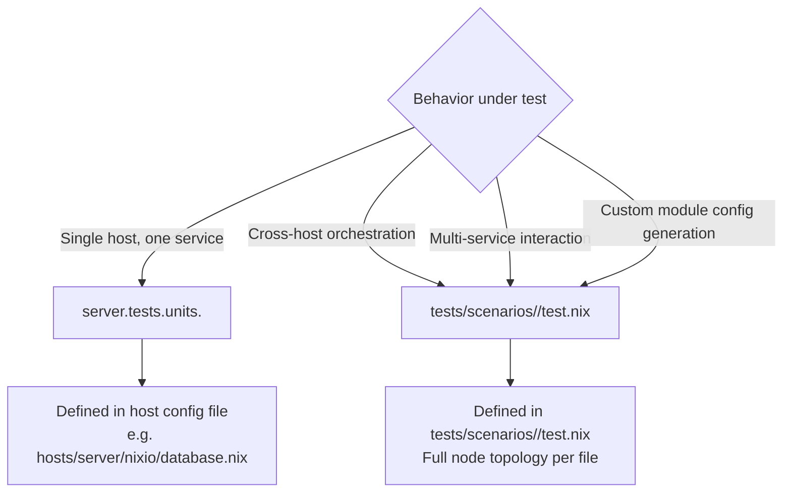
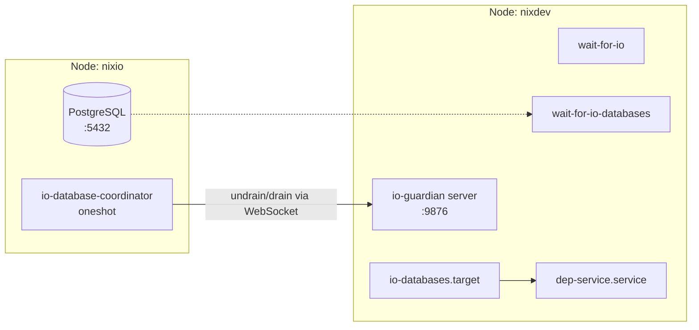
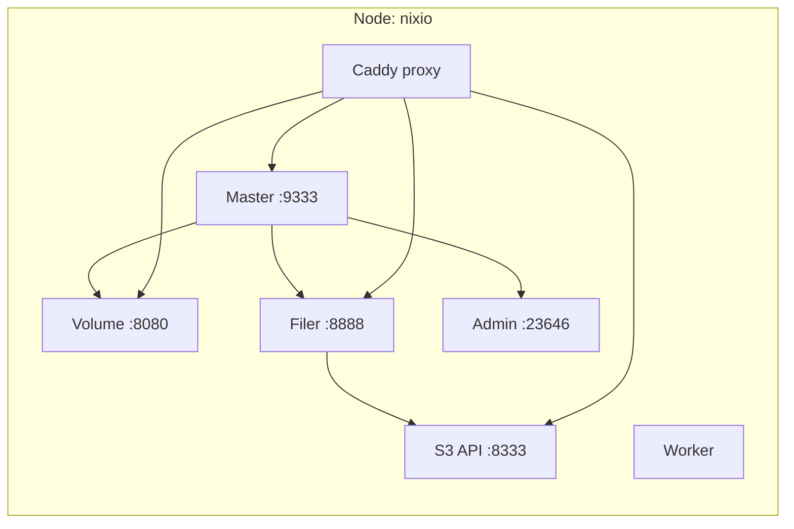
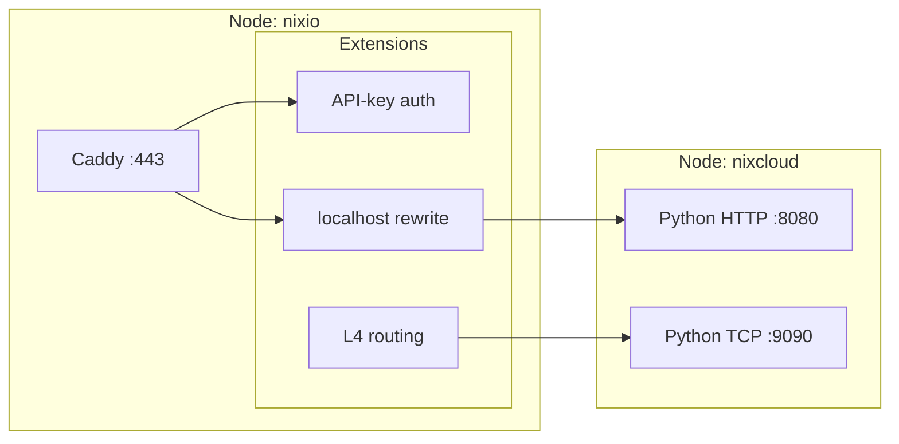
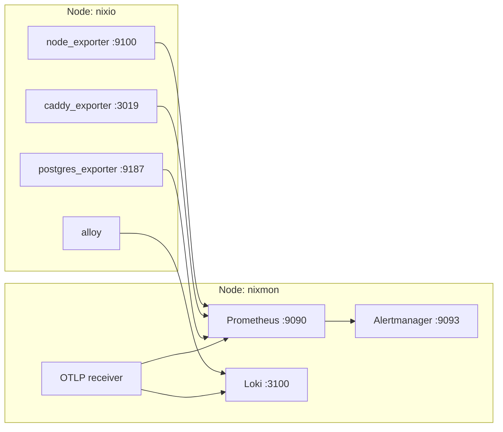
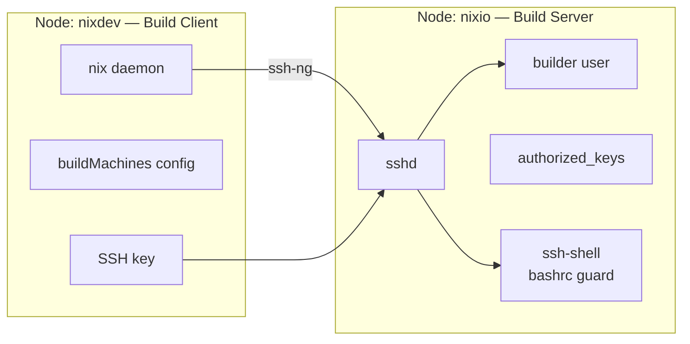

# Design: Server Module Behavior Tests

## Context

The `comprehensive-server-tests` change validates service reachability — ports open, HTTP 200, PING response, unit active. These checks confirm services start but not that they work correctly. The coverage matrix in that design documents service existence (port-check, http-get, cmd — all shallow).

Our custom modules under `modules/nixos/server/` contain real orchestration logic that shallow tests miss entirely:

- **Guardian** (`database/guardian.nix`): Drains downstream database consumers during PG stop, undrains them on restart. `wait-for-io` / `wait-for-io-databases` orchestration between hosts.
- **SeaweedFS** (`storage/seaweedfs.nix`): Multi-process service graph (master, volume, filer, admin, worker, proxy) with bucket creation, S3/filer API, TLS mutual auth, volume server assignment.
- **Proxy extensions** (`proxy/extensions/`): `replaceLocalHost` rewrite, Kanidm OAuth2, API-key auth, L4 TCP/UDP routing, extension priority sorting.
- **Network** (`network.nix`): Subnet-scoped iptables rule generation from `server.network.subnets` + `openPortsForSubnet`.
- **Monitoring** (`monitoring/`): Scrape target generation across all server configs, log shipping via Alloy to Loki, alert routing, OTLP metrics/logs ingestion.
- **Distributed builds** (`distributed-builds.nix`): SSH builder user provisioning, authorized key injection, build machine configuration.
- **SSH shell** (`ssh-shell/`): Restricted bashrc guard that auto-enters a nix-shell on interactive root SSH login.

Existing scenario tests (`io-guardian`, `proxy-routing`, `redis-remote-connect`) validate basic connectivity between hosts but do not assert module behavior — they verify "can connect" not "does the orchestration logic produce the correct state transitions."

## Goals / Non-Goals

### Goals

1. **Six new scenario tests** that exercise custom module behavior end-to-end:
   - `guardian-drain-lifecycle-vm-tests`
   - `seaweedfs-storage-behavior-vm-tests`
   - `proxy-extension-behavior-vm-tests`
   - `monitoring-pipeline-vm-tests`
   - `network-policy-vm-tests`
   - `runtime-infrastructure-vm-tests`

2. **Targeted `server.tests.units` entries** on existing hosts where host-local logic deserves dedicated behavioral assertions (e.g., postgres merged init script correctness, redis DB ID isolation).

3. **Behavioral assertions only**: No "is service active" or "is port open" — these are already covered. Every assertion verifies a state transition, data roundtrip, or cross-component interaction produced by our custom module.

4. **Self-contained, deterministic scenarios**: Each scenario defines all nodes, services, and secrets inline. No dependency on external DNS, ACME, tailscale, or real credentials.

5. **Documentation sync**: When code changes land, `docs/` must be updated simultaneously.

### Non-Goals

- Re-testing upstream nixpkgs behavior (postgres SQL correctness, redis internal replication, prometheus scraping internals).
- Testing services disabled by the VM profile (tailscale, mcpo, ollama).
- Testing Kanidm OAuth2 end-to-end (needs real Kanidm server with provisioned OAuth2 clients).
- Testing ACME certificate issuance (needs cloudflare DNS API).
- Testing FUSE mount I/O via seaweedfs — gated behind feasibility analysis.
- Testing S3 gateway bucket deletion (disabled in production config via `allowDeleteBucketNotEmpty = false`).

## Decisions

### Layering: When to use `server.tests.units` vs explicit `tests/scenarios/`



Decision criteria:

| Test scope | Mode | Rationale |
|---|---|---|
| Postgres merged init script executes correctly | `server.tests.units` on nixio | Single host, single service — verify `initialScript` merge result |
| Redis DB ID isolation (each client gets correct logical DB) | `server.tests.units` on nixio | Single host, verifies `server.database.redis.<name>.database_id` wiring |
| Guardian drain/undrain lifecycle across hosts | `tests/scenarios/guardian-drain-lifecycle` | Two-node orchestration |
| SeaweedFS bucket operation (S3 → filer → volume) | `tests/scenarios/seaweedfs-storage-behavior` | Multi-process within one host, but needs orchestration across master/filer/volume state |
| Proxy localhost rewrite across hosts | `tests/scenarios/proxy-extension-behavior` | Two nodes — rewrite only matters when source != target |
| Monitoring scrape target generation | `tests/scenarios/monitoring-pipeline` | Two nodes — scrape targets span hosts |
| Network subnet rule generation | `tests/scenarios/network-policy` | Single node — but tests module's cross-subnet iptables generation logic |
| Distributed builds SSH setup | `tests/scenarios/runtime-infrastructure` | Two nodes — builder/client separation |

### Scenario Topologies

#### 1. Guardian Drain Lifecycle

**Capability**: `guardian-drain-lifecycle-vm-tests`

**Nodes**:
- `nixio`: IO primary. Postgres on port 5432. io-database-coordinator systemd service.
- `nixdev`: Guardian client. `wait-for-io`, `wait-for-io-databases` services, `io-databases.target`, `io-guardian` WebSocket server.

**Secrets**: Deterministic `IO_GUARDIAN_PSK` via VM test profile sops injection.

**Services explicitly configured**:
- PostgreSQL on nixio (trust auth, `ensureDatabases = ["guardian_test"]`)
- Guardian components on nixdev (WebSocket server, wait-for-io, wait-for-io-databases)
- `server.database.dependentServices` on nixdev pointed at a test service

**Assertions**:
1. `io-database-coordinator` on nixio starts, runs `--action undrain` against nixdev.
2. `io-databases.target` on nixdev reaches active state.
3. `wait-for-io-databases.service` on nixdev completes (postgres reachable).
4. Dependent services on nixdev start after databases are available.
5. Stop postgres on nixio → `io-database-coordinator` ExecStop runs `--action drain`.
6. Verify drain trigger reaches nixdev (check io-guardian service logs for drain command receipt).
7. Restart postgres → `io-database-coordinator` ExecStart runs `--action undrain` again.
8. Dependent services on nixdev restart after databases become available again.

**Node topology**:


**Overlap check**: Existing `tests/scenarios/io-guardian/test.nix` covers DB connectivity (SELECT 1, CREATE TABLE, INSERT). This scenario covers the guardian lifecycle — drain/undrain commands, target activation, dependent service binding. **No overlap.**

#### 2. SeaweedFS Storage Behavior

**Capability**: `seaweedfs-storage-behavior-vm-tests`

**Nodes**:
- `nixio`: Runs all SeaweedFS services (master, volume, filer with S3 API, admin, worker).

**Secrets**: Deterministic TLS certs and JWT tokens via VM test profile. Use self-generated certs at build time (same pattern as `proxy-routing` scenario).

**Services configured**:
- `services.seaweedfs` with master, volume, filer, S3 enabled
- Caddy virtualHosts for seaweed subdomains (master, filer, s3, volume, admin)
- Admin UI, worker

**Assertions**:
1. Master leader election: `weed shell -master=localhost:9333 -command "cluster.status"` returns leader info.
2. Volume server registration: `cluster.status` shows volume server registered.
3. Bucket creation via S3 API: `aws s3api create-bucket --endpoint-url http://localhost:8333 --bucket test-bucket`.
4. Bucket visibility through filer HTTP API: `curl http://localhost:8888/test-bucket/` returns listing.
5. File upload via S3 and retrieval through filer: Upload `PUT /test-bucket/hello.txt`, then GET through filer HTTP.
6. Bucket listing via S3: `aws s3api list-buckets --endpoint-url http://localhost:8333` returns created bucket.
7. Admin UI responds: `curl http://localhost:23646/`.

**FUSE mount I/O**: **Gated behind feasibility analysis.** FUSE requires kernel support in the QEMU guest. If `/dev/fuse` is available in the test VM, add assertions for S3-mounted bucket file I/O roundtrip. If not, skip mount assertions — the S3 → volume → filer pipeline is sufficient coverage.

**Node topology**:


**Overlap check**: Existing `comprehensive-server-tests` has SeaweedFS as http-get on 3 ports (master:9333, volume:8080, filer:8888). This scenario covers bucket CRUD, file roundtrip, and inter-service communication. **No overlap.**

#### 3. Proxy Extension Behavior

**Capability**: `proxy-extension-behavior-vm-tests`

**Nodes**:
- `nixio`: Caddy reverse proxy with extensions configured (localhost rewrite, API-key auth, L4 TCP routing).
- `nixcloud`: Backend service with Python HTTP server (same pattern as existing `proxy-routing` scenario).

**Configured on nixio**:
- Caddy with `server.proxy.virtualHosts` entries:
  - `api-test`: API-key auth enabled, bypass paths for `/health`.
  - `l4-test`: L4 TCP forwarding to nixcloud:9090.
  - `backend-rewrite`: test `replaceLocalHost` — extraConfig references `localhost:8080`, module rewrites to `nixcloud:8080`.
- Deterministic API key in `LoadCredential` via env var.

**Assertions**:
1. **Localhost rewrite**: Configure a vhost with extraConfig `reverse_proxy http://localhost:8080`. Assert the generated Caddy config resolves to `nixcloud:8080` (not `localhost:8080`). Verify by checking the actual rendered config file.
2. **API-key auth bypass**: `GET /health` on api-test vhost returns 200 without API key.
3. **API-key auth reject**: `GET /api/data` on api-test vhost returns 401 without API key.
4. **API-key auth accept**: `GET /api/data` with correct `Req-API-Key` header returns 200.
5. **L4 TCP forwarding**: Connect to L4 TCP port on nixio, verify traffic reaches nixcloud:9090.
6. **Extension priority**: Verify extension output ordering via `server.proxy.extensions` priority values.

**Node topology**:


**Overlap check**: Existing `proxy-routing` scenario tests TLS proxy to backend. This scenario tests extension pipeline behavior specifically. **No overlap.**

#### 4. Monitoring Pipeline

**Capability**: `monitoring-pipeline-vm-tests`

**Nodes**:
- `nixmon`: Monitoring primary. Prometheus, Loki, Alertmanager, Grafana (optional), OTLP receiver.
- `nixio`: Monitoring enabled with exporters (node, caddy, postgres).

**Configured on nixmon**:
- `server.monitoring` with collector and alerting enabled.
- Prometheus configured with `server.monitoring.collector.prometheus` scrape targets.
- Loki with filesystem storage.
- Alloy log processor (`server.monitoring.logs.enable`).
- Alertmanager with route configuration.
- OTLP receiver endpoint.

**Configured on nixio**:
- `server.monitoring` with exporters (node, caddy, postgres) enabled.
- Prometheus node_exporter, caddy_exporter, postgres_exporter running.

**Secrets**: Deterministic OTLP bearer token via VM test profile.

**Assertions**:
1. **Scrape target generation**: Prometheus on nixmon has `nixio:9100` (node), `nixio:3019` (caddy), `nixio:9187` (postgres) in its scrape configs. Verify via `GET /api/v1/targets`.
2. **Metrics reachable**: `GET /api/v1/query?query=up{job="node"}` returns target state.
3. **Log shipping**: Write a log entry on nixio, query Loki on nixmon for it via `loki/api/v1/query_range`.
4. **Alert routing**: Prometheus alert rules are loaded. Verify via `GET /api/v1/rules`.
5. **OTLP ingestion** (if feasible): Send OTLP metric via HTTP to nixmon OTLP endpoint, verify it appears in Prometheus remote-write receiver.

**Node topology**:


**Overlap check**: `comprehensive-server-tests` has prometheus/loki/alertmanager as http-get reachability checks. No existing scenario tests scrape target generation, log shipping, or OTLP — all custom module outputs. **No overlap.**

#### 5. Network Policy

**Capability**: `network-policy-vm-tests`

**Nodes**:
- `nixio`: Single VM with `server.network.subnets` configured for multiple subnets (e.g., 10.0.0.0/24, 192.168.0.0/24) and `server.network.openPortsForSubnet` with specific TCP/UDP ports.

**Configured**:
- Two subnets with ipv4 CIDRs.
- `openPortsForSubnet.tcp = [5432 8080]` — these should generate iptables rules for each subnet CIDR.
- `openPortsForSubnet.udp = [51820 53]`.

**Assertions**:
1. **Rule generation for each subnet**: `iptables -S nixos-fw` contains rules for each port × each subnet combination.
2. **IPv4 rules present**: Verify source CIDR matches configured subnets.
3. **IPv6 rules present** (if configured): Verify `ip6tables -S nixos-fw`.
4. **ExtraCommands and extraStopCommands**: Module appends rules on start, removes on stop. Verify `extraCommands` generated rules exist after boot.
5. **No unexpected ports**: Only configured ports appear in iptables for the nixos-fw chain.

**Reason for single-node scenario**: The module's behavior is entirely about iptables rule generation within a single host. Subnet CIDRs are used as rule source matchers — they don't require actual routing to those subnets.

**Node topology**:
```mermaid
flowchart LR
    subgraph nixio[Node: nixio]
        FW[networking.firewall]
        SN[server.network<br/>subnets: 2 entries]
        OP[openPortsForSubnet<br/>tcp: [5432, 8080]<br/>udp: [51820, 53]]
        IPT[iptables rules<br/>generated per subnet × port]
        SN --> FW
        OP --> FW
        FW --> IPT
    end
```

**Overlap check**: Existing `firewall-port-audit` scenario checks that open ports in config match listening ports. This scenario validates the subnet-scoped rule generation logic specifically. Tests the cartesian product expansion (subnet × port × protocol). **No overlap.**

#### 6. Runtime Infrastructure

**Capability**: `runtime-infrastructure-vm-tests`

**Nodes**:
- `nixio`: Builder server. `server.distributedBuilds.builders = ["nixio"]`.
- `nixdev`: Builder client. `server.distributedBuilds.builders = ["nixio"]`.

**Configured on nixio**:
- `server.distributedBuilds` — builder user created, SSH authorized_keys populated from all server host keys.
- `server.sshShell.enable` — `/etc/bashrc` guard for interactive SSH sessions.

**Configured on nixdev**:
- `server.distributedBuilds` — buildMachines configured pointing at nixio.
- SSH key provisioned (deterministic via VM profile sops injection).
- `nix.settings.builders-use-substitutes = true`.

**Secrets**: Deterministic SSH private key via VM test profile. Same key on both hosts (simplifies test — in production each host has its own key).

**Assertions**:
1. **Builder user exists**: On nixio, `id builder` returns uid, group exists.
2. **Authorized keys populated**: On nixio, builder's `authorized_keys` file contains root's public key from nixdev.
3. **SSH connectivity**: From nixdev, `ssh -o StrictHostKeyChecking=no builder@nixio echo hello` returns hello.
4. **Build machine config**: On nixdev, `/etc/nix/machines` (or nix.conf builders setting) includes nixio with ssh-ng protocol.
5. **SSH shell guard**: SSH into nixio as root from nixdev — verify the bashrc guard fires and nix-shell is entered (or at least `SSH_NIX_SHELL` is set).
6. **NIX_SKIP_SHELL opt-out**: SSH into nixio with `NIX_SKIP_SHELL=1` — verify normal shell, no nix-shell entry.
7. **Ping store** (if feasible): On nixdev, `nix store ping --store ssh-ng://builder@nixio` succeeds.

**Node topology**:


**Overlap check**: `comprehensive-server-tests` has no distributed-builds or ssh-shell coverage. The existing `infrastructure-tests` section explicitly removed distributed-builds as "tested upstream sshd baseline behavior, not custom logic." This scenario tests the **custom module**: builder user provisioning, key injection, build machine config generation, and shell guard. **No overlap.**

### How to Keep Scenarios Self-Contained

1. **No sops secrets** — use inline deterministic values. The VM test profile already converts `sops.secrets.*` to deterministic files. Scenarios should either rely on the profile or provide inline configs that avoid sops altogether.

2. **Self-signed certs** — generate at build time via `pkgs.runCommand` with openssl (see `proxy-routing/test.nix` pattern). Apply to seaweedfs scenarios.

3. **Trust auth for PostgreSQL** — `host all all all trust` in all scenario postgres configs.

4. **Open firewall explicitly** — `networking.firewall.allowedTCPPorts` for every scenario port.

5. **No cloudflare/ACME** — disable `useAcmeCerts = false` for caddy vhosts in proxy scenarios, inject self-signed certs.

6. **Node names resolve automatically** — the NixOS test driver handles DNS. Use node attribute names as hostnames.

7. **Disabled services stay off** — rely on `tests/profiles/vm-test.nix` disabling tailscale/mcpo/ollama. Don't re-disable in scenario nodes.

8. **Deterministic secrets** — for scenarios needing shared secrets (guardian PSK, SSH keys, API keys), use the same inline value on all nodes. The VM profile's deterministic sops injection gives the same content for the same key path.

9. **Do NOT hand-roll module equivalents in scenario nodes.** Every node that exercises
   a capability owned by a `modules/nixos/server/` module must import and use that
   module — not replicate its config inline. If a module cannot be imported in a
   scenario node (missing options, unresolvable deps), fix the module or the VM infra
   first. A scenario testing inline config duplicates what the module already does;
   the two drift apart, and the test produces a false pass.

## Risks / Trade-offs

### Risk: SeaweedFS FUSE Mount I/O

FUSE requires kernel support (`CONFIG_FUSE_FS`) in the VM guest kernel. QEMU VMs in NixOS tests use the host kernel, not a custom kernel. If `/dev/fuse` is not available or FUSE is not loaded:

- **Impact**: Cannot test S3 bucket FUSE mount → file I/O roundtrip.
- **Mitigation**: Assertions for S3 API → filer HTTP → volume storage pipeline cover storage behavior without FUSE. FUSE assertions are conditionally executed only if `/dev/fuse` exists.
- **Trade-off**: If FUSE works, mount assertions provide end-to-end confidence. If not, the S3→filer→volume pipeline is still valuable.
- **Decision**: Gate FUSE mount assertions behind a runtime feasibility check in the testScript.

### Risk: OTLP Ingestion in VM

OTLP endpoint requires alloy running with bearer token auth. If token env var injection fails:

- **Impact**: OTLP metric/log ingestion may not work.
- **Mitigation**: Test OTLP ingestion as a secondary assertion — if alloy environment file is correctly placed and OTLP endpoint responds, proceed. If not, skip OTLP assertions and report.
- **Trade-off**: The OTLP module's core behavior (config generation) is validated by checking the generated alloy config file. Runtime ingestion is a bonus.

### Risk: SeaweedFS Startup Time

SeaweedFS requires master → volume → filer startup sequence with gRPC discovery. In a single VM this should be fast, but if peer discovery timeouts cause delays:

- **Impact**: Flaky tests.
- **Mitigation**: Set `peers = ["none"]` (already in production config for faster startup). Use longer wait_for_unit timeouts. Consider pre-starting services in order via systemd dependencies (already configured).

### Risk: iptables Rules in VM

The `nixos-fw` chain may behave differently in QEMU VMs vs bare metal:

- **Impact**: Network policy scenario assertions may pass in VM but not reflect production behavior.
- **Mitigation**: Assertions check iptables rule syntax and presence, not actual packet filtering behavior. This is appropriate — we're testing the module's rule generation, not the kernel's packet filtering.

### Trade-off: Scenario Complexity vs. Maintenance

6 new scenarios, each with 1-2 VMs, adds significant build time to the VM test CI pipeline.

| Scenario | Nodes | Est. build+run time |
|---|---|---|
| guardian-drain-lifecycle | 2 | ~12min |
| seaweedfs-storage-behavior | 1 | ~8min |
| proxy-extension-behavior | 2 | ~10min |
| monitoring-pipeline | 2 | ~12min |
| network-policy | 1 | ~6min |
| runtime-infrastructure | 2 | ~10min |
| **Total** | **10 VM boots** | **~58min** |

Compare to current `comprehensive-server-tests` total of ~12 scenarios (hosts + cross-service) at ~60min. Adding these 6 doubles the VM test suite runtime.

**Mitigation**: Phase rollout (see Migration Plan). Run in parallel in CI (Woodpecker can parallelize VM tests). Consider adding a scenario filter mechanism (like `testFilter` for units) to run only specific scenarios during development.

## Migration Plan

The rollout is phased by risk and dependency — hardest scenarios (fragile, complex orchestration) in later phases so they don't block easier wins.

### Phase 1: Network Policy + Runtime Infrastructure (Weeks 1-2)

**Lowest risk, single-node or well-understood patterns.**

- **`network-policy`**: Single VM, iptables assertions are deterministic and fast.
- **`runtime-infrastructure`**: SSH key exchange and builder setup follow well-known patterns.

**Deliverables**:
- `tests/scenarios/network-policy/test.nix`
- `tests/scenarios/runtime-infrastructure/test.nix`
- `server.tests.units` entries for postgres init script merge and redis DB ID isolation on nixio.
- Documentation updates in `docs/src/development/vm_integration_tests.md` (new scenario entries).
- If any module code needs adjustment for testability, update in parallel with these scenarios.

### Phase 2: Proxy Extensions + Monitoring Pipeline (Weeks 3-4)

**Medium risk, multi-node but established infrastructure.**

- **`proxy-extension-behavior`**: Builds on existing `proxy-routing` scenario pattern. Only new complexity is API-key and L4 extension assertions.
- **`monitoring-pipeline`**: Two nodes, prometheus/loki/alloy are well-understood. Scrape target assertions are straightforward.

**Deliverables**:
- `tests/scenarios/proxy-extension-behavior/test.nix`
- `tests/scenarios/monitoring-pipeline/test.nix`
- Documentation updates.

### Phase 3: Guardian Drain Lifecycle (Weeks 5-6)

**Higher risk — requires precise drain/undrain orchestration timing.**

**Deliverables**:
- `tests/scenarios/guardian-drain-lifecycle/test.nix`
- Guardian module code adjustments if needed for test compatibility (e.g., making PSK configurable for test injection).
- Documentation updates.

### Phase 4: SeaweedFS Storage Behavior (Weeks 7-8)

**Highest risk — multi-process service graph, runtime FUSE feasibility gate.**

**Deliverables**:
- `tests/scenarios/seaweedfs-storage-behavior/test.nix`
- Feasibility assessment of FUSE mount in QEMU VMs (report findings).
- If FUSE feasible, include mount I/O assertions. If not, document the limitation and test S3/filer pipeline only.
- Documentation updates.

### Documentation Sync

Each phase must include:

1. **Scenario entry** in `docs/src/development/vm_integration_tests.md` — add row to the scenario table.
2. **Module documentation** if test revealed missing docs — update corresponding `docs/modules/nixos/server/<module>.md`.
3. **README update** for any new options or testing patterns discovered.

Run `nix fmt .` after every documentation change.

## Open Questions

1. **FUSE feasibility**: Does the QEMU kernel in the CI runner's NixOS host include `CONFIG_FUSE_FS`? If not, can we inject `fuse.ko` into the VM guest? This determines whether seaweedfs mount I/O assertions are possible. A separate spike (Phase 4) should answer this.

2. **Guardian PSK in tests**: The guardian module hardcodes `sops.secrets."IO_GUARDIAN_PSK"`. The VM test profile generates deterministic sops secrets, so this should work. But if the guardian client/server need PSK matching between hosts, we need deterministic secrets. Confirm the VM profile's sops injection gives identical content for the same key path across nodes.

3. **SSH key provisioning for distributed-builds**: The VM profile generates deterministic sops secrets. For `runtime-infrastructure`, we need nixdev's SSH private key to match nixio's authorized key. Can we inject the same deterministic key on both nodes, or do we need to manually generate and inject a key pair?

4. **Caddy config introspection**: For proxy extension tests, we need to verify the generated Caddy config contains certain directives (localhost rewrite, priority-sorted extensions). Can we read `/etc/caddy/Caddyfile` or `GET /config/` from caddy admin API? The admin API is on `localhost:2019` by default.

5. **Aloy config introspection**: For monitoring pipeline, we need to verify alloy's generated config. Alloy has a `--server.http.listen-addr` flag — currently set to `127.0.0.1:12345`. Can we expose this for HTTP API reads in test mode?

6. **Test filter for scenarios**: The existing `testFilter` mechanism works for `server.tests.units`. Should we add a similar mechanism for scenarios to allow running a subset during development? This would help as the VM test suite grows.

7. **Woodpecker parallelism**: Will the VM CI workflow
