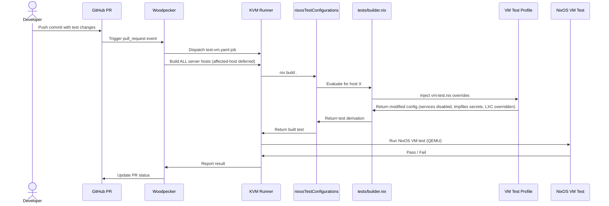

## Context

The original plan defined VM integration tests as CI-only enforcement for all server hosts. Version 2 introduces a structural shift: VM tests no longer go under `checks` (which would trigger `nix flake check`). Instead they live under a new top-level flake attribute `nixosTestConfigurations`, parallel to `nixosConfigurations` and defined in the `nixos` partition. Adding a new top-level flake attribute requires updating `partitionedAttrs` in `flake/default.nix`.

The codebase already has two testing infrastructures:

- **`checks.cluster`** (in `flake/ci/flake-module.nix`): a multi-node test that imports all server hosts via `mkNode.nix`, boots them, and asserts they reach `multi-user.target`. This stays in `ci` — untouched.
- **`server.tests.units`** (in `modules/nixos/server/tests.nix`): an option tree where each host registers named test script functions. Currently consumed only by the cluster test, these become the auto-discovery source for per-host VM tests.

The new design introduces a `nixosTestConfigurations` flake attribute that produces NixOS VM tests per host and per explicit scenario. Test code lives at root `tests/`. Services needing real API keys (Tailscale, MCPO, OAuth-based services) get disabled in VMs by policy. Sops secrets get deterministic file contents via tmpfiles — no real secrets.

This is a cross-cutting Nix change touching flake outputs, test-only modules, NixOS test definitions, CI execution, and docs, so a formal design is warranted.

### Component Diagram

```text
┌─────────────────────────────────────────────────────────────────┐
│                       flake.nix                                  │
│  nixosConfigurations  │  nixosTestConfigurations  │  checks     │
│  (nixos partition)    │  (nixos partition)        │  (ci)       │
├───────────────────────┼───────────────────────────┼──────────────┤
│  nixio, nixai, ...    │  nixio, nixai, ...        │  cluster    │
│                       │  + scenario-*             │             │
└───────────────────────┴───────────────────────────┴──────────────┘
                              │
                              v
                  tests/builder.nix
                    │                    │
                    v                    v
         ┌─────────────────┐  ┌──────────────────────┐
         │ Auto-discovered  │  │ Explicit scenarios    │
         │ per-host tests   │  │ tests/scenarios/*.nix │
         │                  │  │                       │
         │ harvests         │  │ defines nodes +       │
         │ server.tests.    │  │ testScript directly   │
         │ units from each  │  │ (e.g. postgres-backup)│
         │ host's config    │  └──────────────────────┘
         └────────┬────────┘
                  │
                  v
         ┌──────────────────────────────────────────┐
         │  VM test profile                          │
         │  tests/profiles/vm-test.nix               │
         │                                           │
         │  • disables Tailscale, MCPO,              │
         │    OAuth-dependent services (mkForce)      │
         │  • proxmoxLXC.manageNetwork = false        │
         │  • proxmoxLXC.manageHostName = false       │
         │  • systemd.tmpfiles creates runtime        │
         │    secret files with deterministic hash     │
         │    content per secret name                 │
         │  • disables GPU services (ollama/ROCm)     │
         └───────────────────┬──────────────────────┘
                             │
                             v
                  NixOS VM test (QEMU)
                             │
                             v
                  ┌──────────────────────┐
                  │  .woodpecker/        │
                  │  test-vm.yaml        │
                  │  (PR only, KVM)      │
                  └──────────────────────┘
```

## Goals / Non-Goals

**Goals:**

- Expose a `nixosTestConfigurations` flake output with one entry per server host and per explicit scenario.
- Make LXC-oriented server configs evaluable and bootable in NixOS VMs without production edits — achieved through the vm-test profile, not host config changes.
- Generate deterministic dummy sops secrets via tmpfiles so sops-dependent modules can eval and boot in VMs.
- Auto-discover per-service tests from the existing `server.tests.units` option tree for each host.
- Support explicit multi-node scenario tests via files under `tests/scenarios/`.
- Run VM tests only in Woodpecker PR workflows on KVM-capable runners, without touching `nix flake check`.
- Leave the existing `checks.cluster` multi-node test in `ci` untouched.

**Non-Goals:**

- Building a full multi-host integration lab for database or network topologies beyond simple scenario tests.
- Running VM tests via `nix flake check` or in local developer workflows.
- Reworking production module architecture beyond the test-only VM profile.
- Using real deployment secrets, keys, or Proxmox infrastructure in CI.
- Testing services that require real external API keys (these are explicitly disabled in VMs — documented as an accepted coverage gap).

## Decisions

### Decision 1: New `nixosTestConfigurations` flake attr (not under `checks`)

**Choice:** Define a new top-level flake output attribute `nixosTestConfigurations` in the `nixos` partition, parallel to `nixosConfigurations`. Each entry is a NixOS configuration plus test module attachments, with schema `nixosTestConfigurations.<host>` having `config`, `test`, and `passthru.requiredServices`.

**Rationale:** Placing VM tests under `checks` would cause `nix flake check` to build and run them, which is too expensive and contrary to the plan. The `nixos` partition already owns `nixosConfigurations` — co-locating test configurations there keeps all host-derived NixOS eval in one partition. The existing `checks.cluster` stays in `ci` untouched.

**Alternatives considered:**

- Add `vm-test-<host>` checks to the `ci` partition: would require moving host config eval into `ci` or cross-partition referencing, adding complexity.
- Keep under `checks`: triggers on `nix flake check`, violates the plan.

### Decision 2: VM test profile (`tests/profiles/vm-test.nix`)

**Choice:** A single NixOS module injected into every VM test node that applies the following policy:

- **DISABLED (mkForce false):** services needing real external API keys or outbound auth — `services.tailscale.enable`, `services.mcpo.enable`, any OAuth-dependent services (identified by their sops OAuth secret references).
- **DISABLED (mkForce false):** GPU-dependent services — `services.ollama.enable` (covers nixai's ROCm/ollama).
- **OVERRIDDEN:** `proxmoxLXC.manageNetwork = false`, `proxmoxLXC.manageHostName = false` — avoids QEMU test driver network conflicts without preventing eval.
- **GENERATED:** `sops.age.keyFile = "/dev/null"`, `sops.gnupg.home = null`, `sops.gnupg.sshKeyPaths = []`, `sops.validateSopsFiles = false`, and `systemd.tmpfiles.rules` entries that write deterministic content `"test-${builtins.hashString "sha256" name}"` to each `config.sops.secrets.<name>.path`. For `format = "binary"` secrets the same hex-encoded hash is written (no special binary handling needed — the consumer gets consistent deterministic data). This satisfies path wiring without real decryption keys.

**Rationale:** The plan rejects modifying host configs under `hosts/server/*` just to make tests pass. A single injected profile contains the compatibility layer in one place, is version-controlled alongside tests, and is easy to audit.

**Alternatives considered:**

- Remove LXC assumptions from production hosts: too invasive for a testing feature.
- Disable secret-dependent modules entirely: reduces coverage vs. generating path-verified dummy values.
- Maintain per-service override lists in CI config: harder to reason about than a centralized policy module.

**Note:** sops-nix `sops.placeholder.<name>` and `sops.templates.<name>` work automatically in the VM test profile — they return deterministic values when no real keys are available, so no special handling is needed for downstream consumers (MCPO, monitoring, etc.).

### Decision 3: Two test authoring modes — auto-discovered and explicit

**Choice:**

- **Auto-discovered:** For each host in `nixosTestConfigurations.<host>`, harvest `config.server.tests.units` from the evaluated config. These are the same test function hooks already in the codebase. The existing `server.tests` module (`modules/nixos/server/tests.nix`) is the source of truth — no migration needed.
- **Explicit scenarios:** Files under `tests/scenarios/` that define a small NixOS configuration + test script. Example: `tests/scenarios/postgres-backup.nix` defines 2 nodes (server + client) with minimal configs and a testScript verifying backup replication. Output: `nixosTestConfigurations.<scenario-name>`.

**Rationale:** Auto-discovery keeps the framework host-agnostic and avoids brittle hostname lists. Explicit scenarios fill the gap for multi-node or cross-cutting behavior that isn't captured by per-host unit tests.

**Alternatives considered:**

- Only auto-discovered: misses cross-host integration scenarios.
- Only explicit: duplicates what `server.tests.units` already provides.
- Read scenario names from a registry file: unnecessary indirection; filesystem discovery via `builtins.readDir` is sufficient.

### Decision 4: Create `tests/builder.nix` as the builder

**Choice:** `tests/builder.nix` becomes the new VM test builder function accepting either a hostname (auto-discovered mode) or a scenario attribute set (explicit mode). It returns a NixOS test derivation compatible with `pkgs.testers.runNixOSTest`. The output is registered in `nixosTestConfigurations.<name>` by the nixos partition module. `tests/default.nix` (the existing cluster test) remains unchanged.

**Rationale:** Reuses the existing test infrastructure pattern while keeping the existing cluster test (`tests/default.nix`) untouched. The existing `mkNode.nix` is repurposed for host-based tests. Scenario tests define their own nodes.

**Alternatives considered:**

- Extend `tests/default.nix` instead: would modify the existing cluster test file, violating the server-vm-test-harness spec constraint that `tests/default.nix` SHALL NOT be modified.
- Inline test construction in the flake module: couples flake structure to test logic.

### Decision 5: Woodpecker PR gating in a new workflow

**Choice:** New `.woodpecker/test-vm.yaml` workflow. Only runs on `pull_request` events. Uses KVM-capable runners (label `kvm: true`). Builds `nixosTestConfigurations.*` targets with `nix build .#nixosTestConfigurations.<host>.test` for **all** server hosts (per-host pass/fail reporting). Does NOT touch the existing `.woodpecker/check.yaml` which continues to build `checks.cluster`. Affected-host selection (building only tests for hosts modified by the PR) is deferred to a future iteration.

**Rationale:** Separates VM test execution from the main check workflow. PR-only avoids running expensive VM tests on every push to master. KVM gating prevents silent failures on runners without virtualization support.

**Alternatives considered:**

- Add VM test step to existing `check.yaml`: risks slowing down the fast feedback loop for non-VM checks.
- Run on every push: unnecessarily expensive for master commits that passed PR checks.

### Decision 6: Secret policy — tmpfiles-based deterministic secrets

**Choice:** Rather than setting `sops.secrets.<name>.value` (which sops-nix does not support), the VM test profile:

1. **Imports sops-nix** so `sops.secrets.<name>` option declarations exist for all host secrets.
2. **Sets `sops.validateSopsFiles = false`** — prevents sops from erroring at build time about missing or unreadable `.sops` files.
3. **Sets `sops.age.keyFile = "/dev/null"`**, `sops.gnupg.home = null`, `sops.gnupg.sshKeyPaths = []` — satisfies sops-nix's eval-time assertion that at least one key source is configured, while providing no real keys. The key file is never used because tmpfiles secrets are already in place.
4. **Uses `systemd.tmpfiles.rules`** to create each secret file at runtime at `config.sops.secrets.<name>.path` with mode/permissions matching the secret's owner/group settings and content `"test-${builtins.hashString "sha256" name}"`. For `format = "binary"` secrets the same hex-encoded hash is written (no special binary handling needed).

This produces runtime files at the expected paths (`/run/secrets/<name>` by default) so services that read `config.sops.secrets.<name>.path` find a valid file.

**Rationale:** Satisfies sops-dependent modules that read `config.sops.secrets.<name>.path` without needing real encrypted files or decryption keys. The hash is deterministic, so rebuilds are cacheable. Cross-server consistency is guaranteed because the value depends only on the secret name.

**Alternatives considered:**

- Disable all sops-dependent modules: reduces test coverage significantly.
- Commit encrypted dummy files to the repo: adds maintenance burden and risks confusion with production secrets.
- Use `sops.testing` hooks: over-engineered for a wiring-validation concern.

### Decision 7: Service disablement policy (explicit categories)

**Choice:** The VM test profile documents three categories of service handling:

| Category | Action | Examples | Rationale |
|---|---|---|---|
| **DISABLED** | `mkForce false` | Tailscale, MCPO, OAuth-dependent services | Need real external API keys or auth flows unavailable in CI |
| **DISABLED** | `mkForce false` | ollama, ROCm services | Require GPU hardware unavailable in QEMU VMs |
| **OVERRIDDEN** | `mkForce false` on specific options | `proxmoxLXC.manageNetwork`, `proxmoxLXC.manageHostName` | Would interfere with QEMU test driver networking; eval is still valid |
| **GENERATED** | Tmpfiles writes deterministic hash content at secret path (hex-encoded for binary secrets) | All `sops.secrets.<name>` | Validates path wiring without real secret material |

**Rationale:** Explicit categorization makes the coverage gap visible and auditable. Engineers can see at a glance what is and isn't tested.

## Risks / Trade-offs

**[KVM availability]** → VM test throughput and reliability depend on Woodpecker runners exposing `/dev/kvm`. Without KVM, tests will be extremely slow or may hang.
*Mitigation:* Gate the workflow with a `kvm: true` runner label. Document the requirement. Fail fast if `/dev/kvm` is unavailable.

**[LXC mismatch (minimal)]** → The VM test profile overrides `proxmoxLXC.manageNetwork` and `proxmoxLXC.manageHostName` to false. Remaining LXC-specific behavior (e.g., `core.generators.proxmoxLXC.enable`) may still eval but should not block boot.
*Mitigation:* Centralize overrides in `tests/profiles/vm-test.nix` and expand incrementally as incompatibilities are discovered. The impact is minimal because the overrides target the specific options known to conflict with QEMU.

**[Secret fidelity gap]** → Deterministic tmpfiles-based secrets validate path wiring, not real secret values. A module that reads a secret and uses it for a cryptographic operation will get a garbage value in the VM.
*Mitigation:* Treat this framework as pre-deploy structural validation, not a substitute for runtime production secret correctness. Services that require real secrets to function are in the DISABLED category and won't be tested.

**[Service coverage gap]** → Because API-key-dependent services (Tailscale, MCPO, OAuth) are disabled, they are not tested in VMs.
*Mitigation:* Accept as a documented gap. These services are exercised by other means (integration tests on real infra, manual validation). The auto-discovered `server.tests.units` may still contain useful config-level assertions for these services that run without the service being enabled (e.g., "validate that the config file would be syntactically correct").

**[Build time]** → VM tests are expensive to build. Adding one per host plus scenarios significantly increases CI build time.
*Mitigation:* Use `nix-fast-build` or similar caching strategies. The Woodpecker workflow is PR-only, not on every push. Consider affected-host selection in a future iteration.

**[mkForce collision]** → The VM test profile uses `mkForce false` on `services.tailscale.enable`, `services.mcpo.enable`, and `services.ollama.enable`. If any other module applies `mkForce` to the same options, evaluation will fail with a collision error.
*Mitigation:* Document this constraint; no current module in the codebase conflicts.

## Migration Plan

1. **Create `tests/profiles/vm-test.nix`**: the VM test profile module with service disablement, proxmoxLXC overrides, sops-nix import + key clearing + validation disabling, and `systemd.tmpfiles.rules` for deterministic secret file creation.
2. **Create `tests/scenarios/` directory**: initially empty, with docs explaining the file format.
3. **Create `tests/builder.nix`**: the VM test builder function that accepts hostname (auto-discovered) or scenario attrset (explicit), applies the VM test profile, and returns a NixOS test derivation. The existing `tests/default.nix` (cluster test) remains unchanged.
4. **Add `nixosTestConfigurations` to the nixos partition**: in `flake/nixos/flake-module.nix`, generate `nixosTestConfigurations.<host>` for each server host using `tests/builder.nix`, plus scan `tests/scenarios/` for scenario-based entries. Also update `partitionedAttrs` in `flake/default.nix` to include `nixosTestConfigurations`.
5. **Add `.woodpecker/test-vm.yaml`**: new workflow for pull_request events, builds `nixosTestConfigurations.*.test` on KVM-capable runners.
6. **Document usage and extension points**: update `docs/` with how to add per-host unit tests (existing `server.tests.units` mechanism), how to add explicit scenarios, and the service disablement policy.
7. **Roll back**: remove the `nixosTestConfigurations` output, VM test profile, scenario files, and Woodpecker workflow. `checks.cluster`, production host configs, and `server.tests` module are unchanged.

### Sequence Diagram



## Open Questions

1. (RESOLVED) Affected-host selection (only building VM tests for hosts touched by the PR) is deferred. The initial implementation runs ALL server VM tests on every PR. The `detect-affected-outputs.nu` script under `flake/ci/scripts/` could be adapted later.
2. Whether scenario tests should be registered in a manifest (`tests/scenarios/default.nix`) or discovered by filesystem scan. Filesystem scan is simpler but may need sorting guarantees for deterministic eval.
3. How to handle services that are partway between disabled and testable — e.g., a service that needs a real API key for its main function but has useful config-level assertions that don't require the service to be running. Should `server.tests.units` house these assertions?
